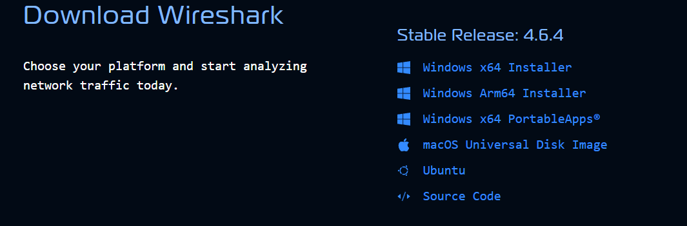
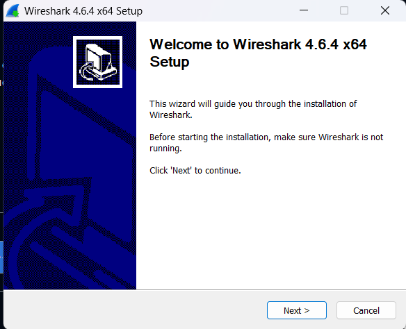
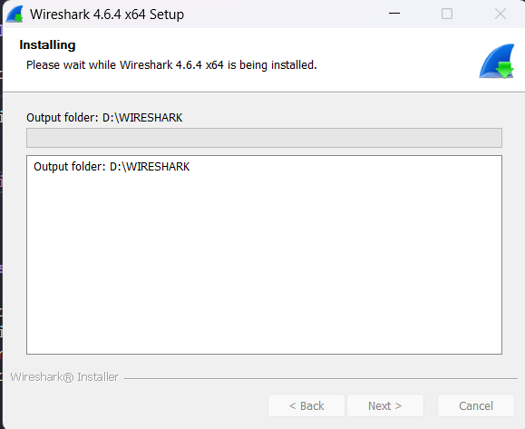
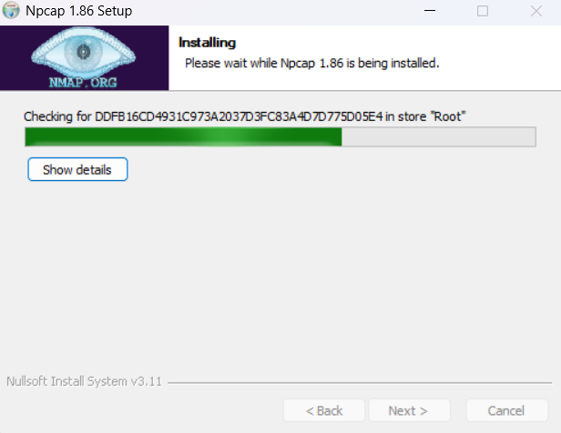
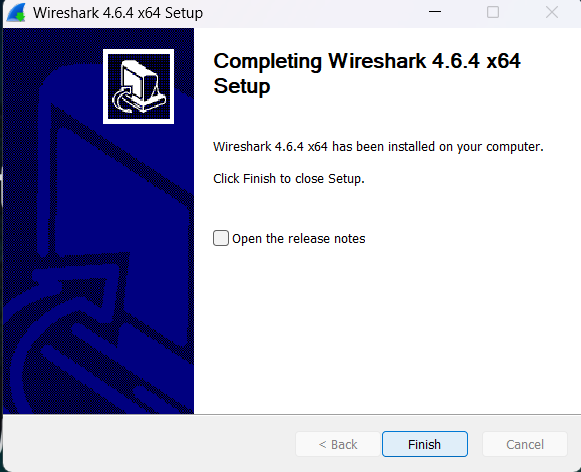
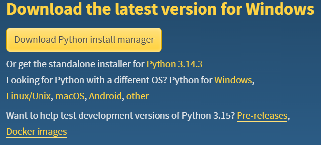
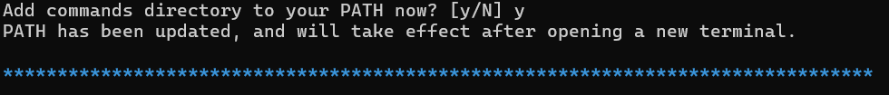

Nama: Adisty Fatika Ardani
NIM: 103072400091

---

# Modul 1 Running Modul

## Tujuan Praktikum
1. Mahasiswa mengetahui aturan dan sistem pelaksanaan praktikum
2. Mahasiswa mengetahui tools yang akan digunakan dan memastikan tools berfungsi dengan baik selama pelaksanaan praktikum

---

## PERSIAPAN

Sebelum memulai praktikum, terdapat dua tools utama yang perlu dipastikan telah terinstall secara berurutan:

1. **Wireshark:** sebagai tools utama untuk analisis jaringan dan penangkapan paket data
2. **Python:** sebagai tools pendukung untuk pemrosesan data dan scripting selama praktikum

---

## INSTALASI WIRESHARK

### Langkah 1: Unduh File Installer Wireshark

File installer Wireshark dapat diunduh dari situs resmi berikut:
**https://www.wireshark.org/**

Pada praktikum ini digunakan Wireshark versi terbaru yang tersedia. Pilih installer yang sesuai dengan sistem operasi yang digunakan. File installer berupa file `.exe` yang bersifat *self-installing*, artinya file tersebut akan mengekstrak dan menyalin dirinya sendiri ke direktori yang ditentukan secara otomatis.

### Langkah 2: Menjalankan Installer Wireshark

Setelah file installer berhasil diunduh, jalankan file tersebut dengan cara melakukan double-click pada file installer. Pastikan untuk menjalankan installer dengan hak akses Administrator agar proses instalasi dapat berjalan dengan baik.

### Langkah 3: Memilih Direktori Instalasi

Pilih lokasi penyimpanan instalasi Wireshark dengan menekan tombol **Browse**. Akan tampil direktori sistem dan kita dapat memilih folder yang diinginkan sebagai tempat instalasi. Jika tidak ingin mengubah lokasi default, langsung klik **Next** untuk melanjutkan.

### Langkah 4: Mengikuti Alur Instalasi

Ikuti semua alur instalasi yang disediakan hingga proses instalasi selesai sepenuhnya. Pada proses instalasi, Wireshark juga akan menawarkan instalasi **Npcap** yang merupakan komponen penting untuk menangkap paket jaringan. Pastikan komponen tersebut ikut diinstall. Klik **Finish** untuk menutup installer.

### Langkah 5: Instalasi Selesai

Setelah proses instalasi selesai, Wireshark siap digunakan. Wireshark merupakan *network protocol analyzer* yang memungkinkan praktikan untuk menangkap dan menganalisis lalu lintas data secara real-time di jaringan komputer.

---

## INSTALASI PYTHON

Setelah instalasi Wireshark selesai, tahap selanjutnya adalah melakukan instalasi Python yang dapat diunduh di **https://www.python.org/downloads/**. Pilih installer yang sesuai dengan sistem operasi yang digunakan. Proses instalasi dapat dilakukan sama seperti instalasi software pada umumnya dengan hanya mengikuti alur instalasi hingga proses selesai.

### Langkah 1: Menjalankan Installer Python

Jalankan file installer Python yang telah diunduh. Pada halaman pertama installer, pastikan untuk mencentang opsi **"Add Python to PATH"** sebelum melanjutkan instalasi agar Python dapat diakses melalui command line.

### Langkah 2: Instalasi Selesai

Setelah proses instalasi selesai, Python siap digunakan sebagai tools pendukung selama praktikum berlangsung.