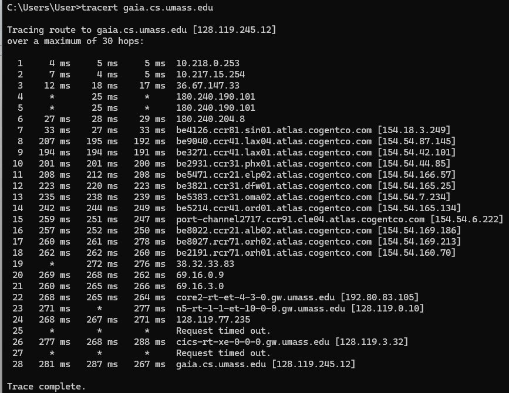
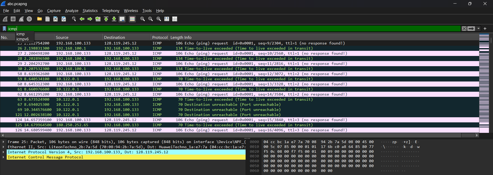
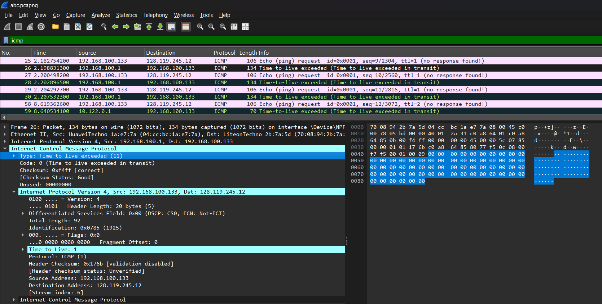
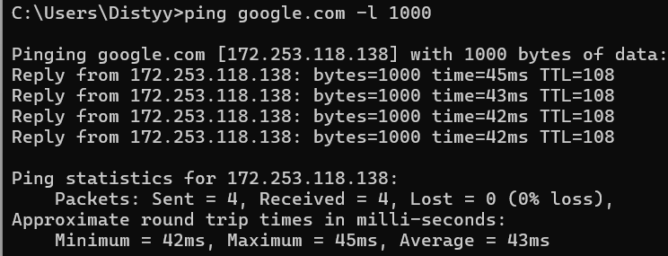
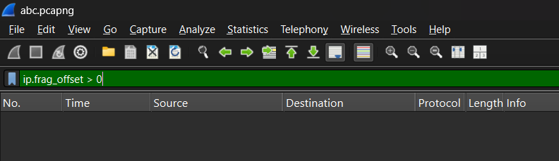
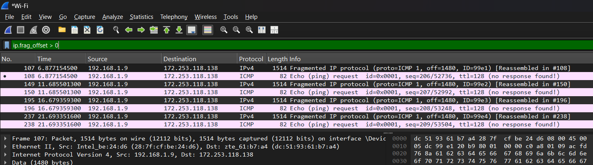
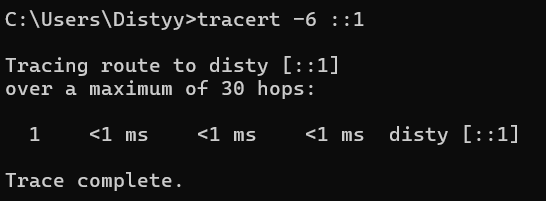
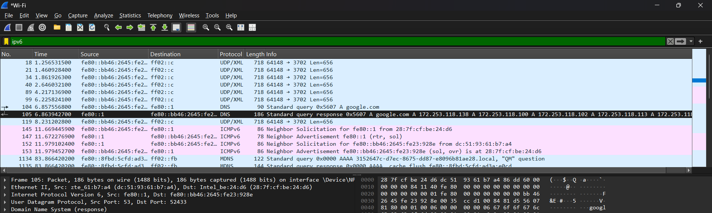

Nama: Adisty Fatika Ardani
NIM: 103072400091

---

# Modul 10 IP

## Tujuan Praktikum
1. Mahasiswa dapat menginvestigasi cara kerja protokol IP menggunakan Wireshark

---

## PENGANTAR

Pada modul ini dipelajari protokol IP dengan fokus pada datagram IPv4 dan IPv6. Terdapat tiga bagian utama analisis paket IPv4 menggunakan traceroute, fragmentasi IP, dan sekilas tentang IPv6. Sebelum masuk ke praktikum, ada beberapa konsep penting yang perlu dipahami terlebih dahulu.

**IP Address** (*Internet Protocol Address*) adalah alamat unik yang diberikan kepada setiap perangkat yang terhubung ke jaringan agar bisa saling berkomunikasi. IPv4 menggunakan alamat 32-bit yang ditulis dalam 4 oktet desimal yang dipisahkan titik, contohnya `192.168.1.1`. Setiap oktet bernilai antara 0–255. IP Address terbagi menjadi dua bagian **Network ID** yang menunjukkan jaringan mana perangkat tersebut berada, dan **Host ID** yang menunjukkan identitas perangkat di dalam jaringan tersebut. Pembagian ini ditentukan oleh **subnet mask**, misalnya `255.255.255.0` berarti 24 bit pertama adalah Network ID dan 8 bit sisanya adalah Host ID.

**ICMP** (*Internet Control Message Protocol*) adalah protokol yang digunakan untuk mengirimkan pesan kontrol dan error di jaringan. ICMP tidak membawa data aplikasi ia digunakan oleh perangkat jaringan untuk melaporkan kondisi tertentu, seperti TTL yang habis atau tujuan yang tidak dapat dicapai.

**TTL** (*Time to Live*) adalah nilai pada header IP yang menunjukkan berapa banyak router yang boleh dilalui oleh sebuah datagram. Setiap router yang meneruskan datagram akan mengurangi TTL sebesar 1. Ketika TTL mencapai 0, router akan membuang datagram tersebut dan mengirimkan pesan ICMP *Time Exceeded* (tipe 11) kembali ke pengirim. Mekanisme inilah yang dimanfaatkan oleh traceroute untuk memetakan rute jaringan.

**MTU** (*Maximum Transmission Unit*) adalah ukuran maksimum paket yang dapat dikirimkan melalui suatu jalur jaringan. Ethernet standar memiliki MTU 1500 byte. Jika datagram lebih besar dari MTU, maka datagram tersebut akan dipecah menjadi beberapa fragmen yang lebih kecil proses ini disebut fragmentasi IP.

---

## BAGIAN 1: IPv4 DASAR

### Langkah 1: Menjalankan Traceroute

Traceroute dijalankan dari Command Prompt Windows menggunakan perintah berikut:

```
> tracert gaia.cs.umass.edu
```

Perintah ini mengirimkan serangkaian paket ICMP Echo Request dengan nilai TTL yang dimulai dari 1 dan terus bertambah. Setiap router yang membuang paket karena TTL habis akan mengirimkan balasan ICMP TTL Exceeded, sehingga traceroute bisa memetakan setiap hop yang dilalui hingga tujuan akhir.

Berikut hasil output traceroute ke `gaia.cs.umass.edu`:



Berdasarkan hasil di atas, paket melewati 28 hop sebelum sampai ke `gaia.cs.umass.edu [128.119.245.12]`. Beberapa hop menampilkan tanda `*` yang berarti router tersebut tidak merespons pesan ICMP hal ini umum terjadi pada router yang dikonfigurasi untuk memblokir ICMP demi keamanan.

### Langkah 2: Capture Paket dengan Wireshark

Buka file `abc.pcapng` di Wireshark, kemudian masukkan filter berikut pada kolom display filter:

```
icmp
```

Filter ini memastikan hanya paket ICMP yang ditampilkan, menyembunyikan protokol lain yang tidak relevan dengan analisis ini.

Berikut tampilan Wireshark setelah filter `icmp` diterapkan pada file `abc.pcapng`:



### Langkah 3: Menganalisis Paket ICMP TTL Exceeded

Pilih salah satu paket berwarna merah muda bertuliskan **Time-to-live exceeded** pada packet-listing window, kemudian perluas bagian **Internet Protocol Version 4** pada packet-details window di bawahnya.

Berikut tampilan detail paket ICMP TTL Exceeded yang dipilih, dengan bagian dropdown Internet Protocol Version 4 yang diperluas:



Pada bagian dropdown **Internet Control Message Protocol**, terlihat **Type: Time-to-live exceeded (11)** yang menandakan paket ini adalah respons dari router yang membuang datagram karena TTL-nya habis. Pada bagian **Internet Protocol Version 4** terlihat informasi penting seperti nilai TTL, alamat sumber (`192.168.100.1`) yang merupakan router yang mengirim pesan error, dan alamat tujuan (`192.168.100.133`) yang merupakan komputer pengirim traceroute.

---

## BAGIAN 2: FRAGMENTASI IP

### Konsep Fragmentasi

Fragmentasi terjadi ketika datagram IP lebih besar dari MTU jalur yang dilalui. Pada jaringan Ethernet, MTU standarnya adalah 1500 byte. Datagram yang lebih besar akan dipecah menjadi beberapa fragmen oleh router, dan fragmen-fragmen ini akan digabungkan kembali oleh host penerima.

### Langkah 1: Mengirim Ping Ukuran Besar

Untuk memaksa terjadinya fragmentasi, dikirimkan ping dengan ukuran 1000 byte menggunakan perintah berikut:

```
tracert google.com
```

```
ping google.com -l 1000
```

Kombinasi ukuran data dengan overhead header IP dan ICMP bisa memicu fragmentasi tergantung konfigurasi jaringan yang dilalui. Datagram yang terlalu besar untuk melewati suatu jalur akan dipecah menjadi beberapa fragmen oleh router.

Berikut hasil output ping dengan ukuran besar:



### Langkah 2: Mencari Fragmentasi di Wireshark menggunakan abcd.pcapng

Percobaan pertama dilakukan dengan membuka file `abcd.pcapng` di Wireshark, kemudian menerapkan filter berikut:

```
ip.frag_offset > 0
```

Berikut tampilan Wireshark saat filter diterapkan pada file `abcd.pcapng`:



Sayangnya pada file `abcd.pcapng` tidak ditemukan paket fragmentasi tidak ada paket yang memiliki nilai `frag_offset > 0`. Hal ini terjadi karena paket-paket yang tertangkap di file tersebut ukurannya tidak melebihi MTU sehingga tidak ada yang perlu difragmentasi.

### Langkah 3: Mencari Fragmentasi menggunakan Ping ke Google

Karena percobaan pertama tidak membuahkan hasil, dilakukan capture ulang dengan mengirimkan ping berukuran besar ke Google sambil Wireshark berjalan, kemudian filter yang sama diterapkan kembali:

```
ip.frag_offset > 0
```

Berikut tampilan Wireshark setelah filter `ip.frag_offset > 0` diterapkan pada hasil capture ping ke Google:



Berdasarkan hasil capture di atas, terlihat paket-paket bertipe **Fragmented IP protocol** dengan panjang 1514 byte dan offset 1480. Keterangan **[Reassembled in #108]** menunjukkan fragmen ini akan digabungkan kembali di paket nomor 108. Setiap fragmen membawa 1480 byte data, dan fragmen terakhir membawa sisa data yang ukurannya lebih kecil inilah cara IP memecah datagram besar agar bisa melewati MTU jaringan.

---

## BAGIAN 3: IPv6

### Konsep IPv6

IPv6 adalah versi terbaru dari protokol IP yang menggunakan alamat 128-bit, berbeda dengan IPv4 yang hanya 32-bit. IPv6 hadir untuk mengatasi keterbatasan ruang alamat IPv4 yang semakin habis. Alamat IPv6 ditulis dalam format heksadesimal yang dipisahkan oleh titik dua, contohnya `2404:6800:4003:c0f::bc`.

### Langkah 1: Mengirim Ping IPv6

Untuk menghasilkan lalu lintas IPv6, jalankan perintah berikut:

```
>tracert -6 ::1
```

Perintah `-6` memaksa Windows untuk menggunakan IPv6 dalam mengirimkan ping. Ini akan menghasilkan paket ICMPv6 yang bisa diamati di Wireshark.

Berikut hasil output ping IPv6 ke google.com:



### Langkah 2: Mencari Paket IPv6 di Wireshark

Untuk menampilkan hanya paket IPv6 di Wireshark, gunakan filter berikut:

```
ipv6
```

Filter ini menyaring semua paket yang menggunakan protokol IPv6, termasuk ICMPv6, DNS AAAA query, dan lalu lintas IPv6 lainnya.

Berikut tampilan Wireshark setelah filter `ipv6` diterapkan:



Berdasarkan hasil capture di atas, terlihat berbagai jenis paket IPv6 yang tertangkap. Paket UDP/XML dari alamat `fe80::bb46:2645:fe2...` ke `ff02::c` adalah paket multicast IPv6 yang dikirim secara periodik. Paket DNS terlihat pada baris 104 dan 105 paket 104 adalah query DNS untuk `google.com` dan paket 105 adalah responnya yang mengembalikan beberapa alamat IP. Terdapat juga paket ICMPv6 berupa **Neighbor Solicitation** dan **Neighbor Advertisement** yang merupakan mekanisme IPv6 untuk mengetahui alamat MAC dari perangkat lain di jaringan lokal setara dengan ARP di IPv4. Kolom Source dan Destination menampilkan alamat IPv6 lengkap dalam format heksadesimal yang dipisahkan titik dua.
