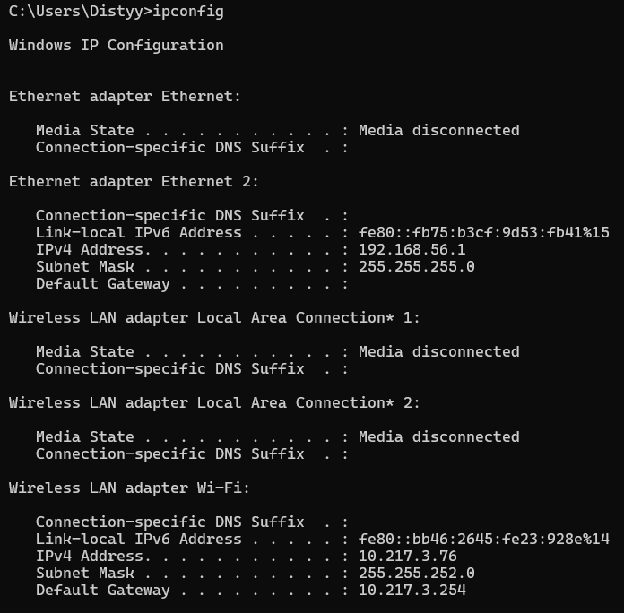
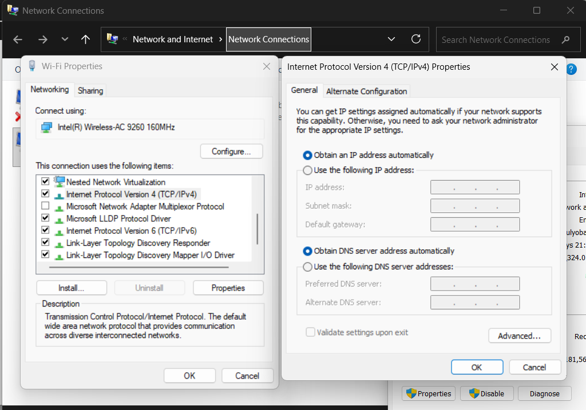
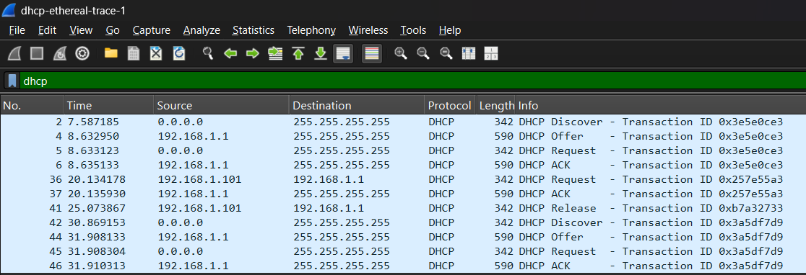

Nama: Adisty Fatika Ardani
NIM: 103072400091

---

# Modul 11 DHCP

## Tujuan Praktikum
1. Mahasiswa dapat menginvestigasi cara kerja protokol DHCP menggunakan Wireshark

---

## APA ITU DHCP

DHCP (*Dynamic Host Configuration Protocol*) adalah protokol jaringan yang memungkinkan sebuah server secara otomatis memberikan konfigurasi IP kepada perangkat yang terhubung ke jaringan. Tanpa DHCP, setiap perangkat harus dikonfigurasi secara manual mulai dari IP address, subnet mask, default gateway, hingga DNS server. DHCP menghilangkan kebutuhan itu dengan mengotomatiskan seluruh proses tersebut setiap kali perangkat terhubung ke jaringan.

---

## KELEBIHAN DAN KEKURANGAN DHCP

**Kelebihan** dari penggunaan DHCP adalah konfigurasi jaringan menjadi jauh lebih mudah dan efisien karena tidak perlu mengatur IP setiap perangkat secara manual. DHCP juga mencegah konflik IP karena server yang mengatur alokasi alamat tidak mungkin dua perangkat mendapat IP yang sama. Selain itu, ketika perangkat tidak aktif, IP-nya bisa dikembalikan ke pool dan dialokasikan ulang ke perangkat lain sehingga penggunaan alamat IP lebih efisien.

**Kekurangan** DHCP adalah IP yang diberikan bisa berubah setiap kali perangkat terhubung ulang ke jaringan, sehingga tidak cocok untuk perangkat yang membutuhkan IP tetap seperti server atau printer jaringan. Selain itu, jika server DHCP mati, semua perangkat baru tidak bisa mendapatkan IP dan tidak bisa terhubung ke jaringan.

---

## PROSES DORA

DORA adalah singkatan dari empat tahap yang terjadi saat perangkat meminta IP dari server DHCP:

**Discover** perangkat yang baru terhubung ke jaringan belum punya IP, sehingga ia mengirimkan pesan broadcast ke alamat `255.255.255.255` untuk mencari server DHCP yang tersedia. Pesan ini dikirim dari alamat `0.0.0.0` karena perangkat belum punya IP sama sekali.

**Offer** server DHCP yang menerima pesan Discover membalas dengan menawarkan sebuah IP address beserta konfigurasi lainnya seperti subnet mask, gateway, dan durasi sewa (*lease time*). Pesan ini juga dikirim secara broadcast karena client belum punya IP.

**Request** client yang menerima tawaran membalas dengan mengirimkan pesan Request untuk mengkonfirmasi bahwa ia menerima IP yang ditawarkan. Pesan ini tetap broadcast agar server DHCP lain yang mungkin juga mengirim Offer tahu bahwa tawaran mereka tidak dipilih.

**Acknowledge** server mengirimkan pesan ACK sebagai konfirmasi akhir bahwa IP tersebut resmi diberikan kepada client. Setelah menerima ACK, client bisa mulai menggunakan IP tersebut untuk berkomunikasi di jaringan.

---

## PRAKTIKUM

### Langkah 1: Mengecek Konfigurasi IP dengan ipconfig

Sebelum menganalisis paket DHCP, terlebih dahulu dicek konfigurasi IP yang sedang aktif di komputer menggunakan perintah berikut di Command Prompt:

```
C:\Users\Distyy> ipconfig
```

Berikut hasil output perintah `ipconfig`:



Berdasarkan output di atas, terdapat beberapa adapter jaringan yang terdeteksi. Pada **Ethernet adapter Ethernet 2** terlihat IPv4 Address `192.168.56.1` dengan subnet mask `255.255.255.0`. Pada **Wireless LAN adapter Wi-Fi** terlihat IPv4 Address `10.217.3.76` dengan subnet mask `255.255.252.0` dan default gateway `10.217.3.254` ini adalah IP yang diberikan oleh server DHCP kampus secara otomatis.

### Langkah 2: Konfigurasi DHCP di Network Properties

Untuk memastikan komputer menggunakan DHCP (bukan IP statis), dapat dicek melalui pengaturan jaringan Windows. Buka **Network Connections → Wi-Fi Properties → Internet Protocol Version 4 (TCP/IPv4) → Properties**.

Berikut tampilan pengaturan IPv4 yang menunjukkan komputer dikonfigurasi untuk mendapatkan IP secara otomatis:



Opsi **Obtain an IP address automatically** dan **Obtain DNS server address automatically** dipilih ini berarti komputer akan meminta IP ke server DHCP setiap kali terhubung ke jaringan, bukan menggunakan IP yang diset manual.

### Langkah 3: Menganalisis Paket DHCP di Wireshark

Buka file `dhcp-ethereal-trace-1` di Wireshark, kemudian masukkan filter berikut:

```
dhcp
```

Berikut tampilan Wireshark setelah filter `dhcp` diterapkan:



Berdasarkan hasil capture di atas, terlihat dengan jelas proses DORA yang terjadi. Paket nomor 2 adalah **DHCP Discover** yang dikirim dari `0.0.0.0` ke `255.255.255.255` client belum punya IP sehingga broadcast ke semua perangkat. Paket nomor 4 adalah **DHCP Offer** dari server `192.168.1.1` yang menawarkan IP ke client. Paket nomor 5 adalah **DHCP Request** dari client yang mengkonfirmasi penerimaan tawaran, dan paket nomor 6 adalah **DHCP ACK** dari server sebagai konfirmasi akhir. Keempat paket ini memiliki Transaction ID yang sama (`0x3e5e0ce3`) yang menandakan mereka merupakan satu sesi DHCP yang utuh. Selanjutnya terlihat juga sesi DHCP berikutnya dengan Transaction ID yang berbeda, menunjukkan adanya proses renewal atau koneksi perangkat baru.