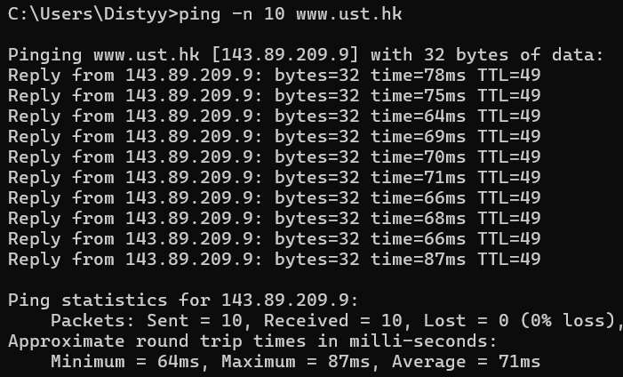
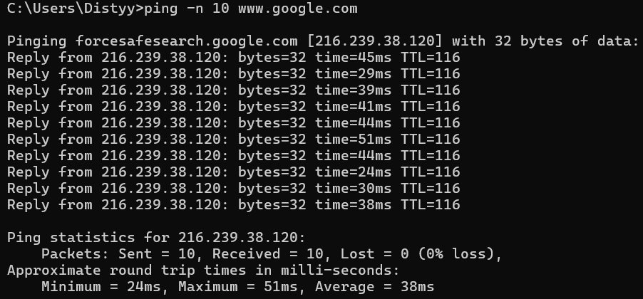
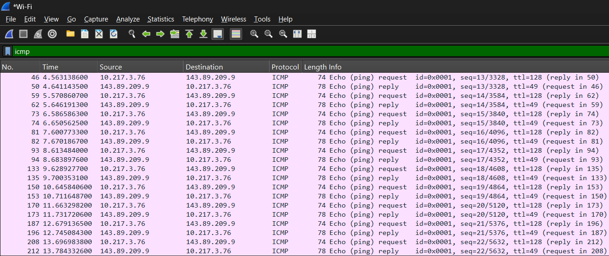
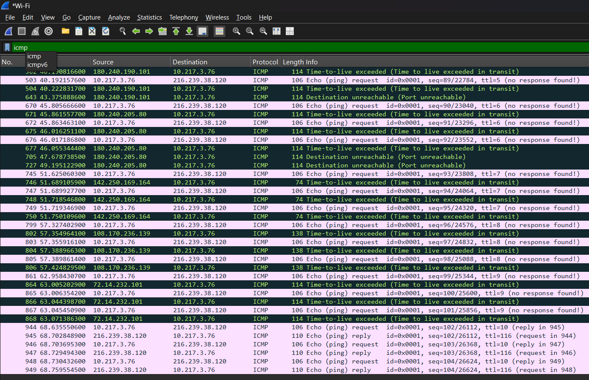
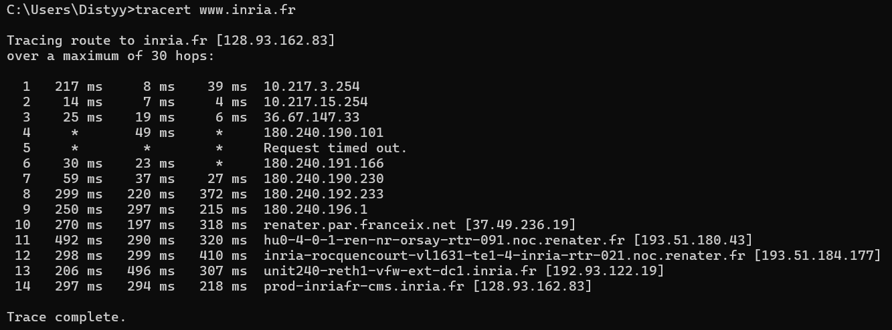
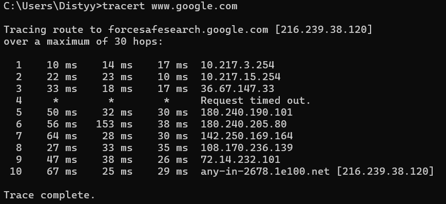
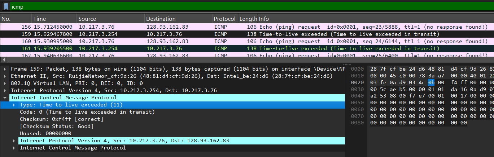
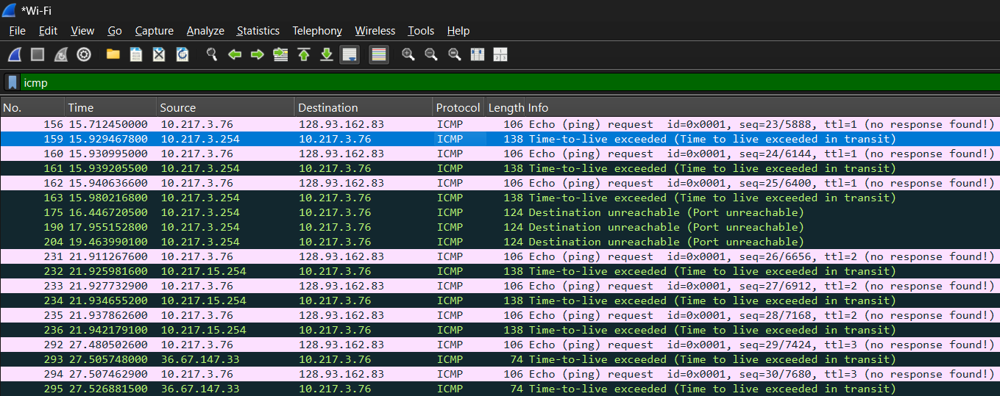

Nama: Adisty Fatika Ardani
NIM: 103072400091

---

# Modul 12 ICMP dan Asistensi Tugas Besar

## Tujuan Praktikum
1. Mahasiswa dapat menginvestigasi cara kerja protokol ICMP menggunakan Wireshark
2. Mahasiswa dapat membuat program ICMP Pinger
3. Melakukan asistensi dan laporan progress pengerjaan tugas besar

---

## PENGANTAR

ICMP (*Internet Control Message Protocol*) adalah protokol yang digunakan untuk mengirimkan pesan kontrol dan error di jaringan. Pada modul ini ICMP dieksplorasi melalui dua program utama **Ping** dan **Traceroute**. Ping digunakan untuk memverifikasi apakah sebuah host aktif dengan mengirimkan ICMP Echo Request dan menunggu ICMP Echo Reply. Traceroute digunakan untuk memetakan rute yang dilalui paket dari sumber ke tujuan dengan memanfaatkan mekanisme TTL dan pesan ICMP Time Exceeded.

---

## ICMP DAN PING

### Langkah 1: Ping ke www.ust.hk

Percobaan pertama dilakukan dengan mengirim 10 paket ping ke server Universitas Sains dan Teknologi Hong Kong menggunakan perintah:

```
C:\Users\Distyy> ping -n 10 www.ust.hk
```

Berikut hasil output ping ke `www.ust.hk`:



Berdasarkan output di atas, 10 paket berhasil dikirim dan diterima dengan 0% packet loss. Reply datang dari `143.89.209.9` dengan TTL=49 dan rata-rata RTT 71ms. Nilai TTL=49 menunjukkan paket telah melewati beberapa router sebelum sampai ke tujuan dihitung dari TTL awal 64 dikurangi jumlah hop yang dilalui.

### Langkah 2: Ping ke www.google.com

Percobaan kedua dilakukan dengan mengirim 10 paket ping ke Google:

```
C:\Users\Distyy> ping -n 10 www.google.com
```

Berikut hasil output ping ke `www.google.com`:



Reply datang dari `216.239.38.120` dengan TTL=116 dan rata-rata RTT 38ms. RTT ke Google lebih rendah dibanding ke Hong Kong karena jarak fisik server Google yang lebih dekat dari lokasi pengiriman.

### Langkah 3: Analisis Paket ICMP Ping HK di Wireshark

Jalankan Wireshark bersamaan dengan ping ke `www.ust.hk`, kemudian hentikan capture dan terapkan filter:

```
icmp
```

Berikut tampilan Wireshark hasil capture ping ke `www.ust.hk`:



Pada packet-listing window terlihat pasangan paket ICMP secara bergantian paket berwarna putih adalah **Echo Request** yang dikirim dari `10.217.3.76` ke `143.89.209.9`, dan paket berwarna merah muda adalah **Echo Reply** yang dikirim balik dari server ke komputer. Setiap pasangan request-reply memiliki sequence number yang sama untuk mencocokkan request dengan reply-nya.

### Langkah 4: Analisis Paket ICMP Ping Google di Wireshark

Berikut tampilan Wireshark hasil capture ping ke `www.google.com` dengan filter `icmp`:



Terlihat pola yang sama paket Echo Request dikirim dari `10.217.3.76` ke `216.239.38.120` dan dibalas dengan Echo Reply. Selain itu terdapat paket **Time-to-live exceeded** dan **Destination unreachable** yang merupakan respons dari router perantara saat TTL habis di tengah perjalanan ini merupakan bagian dari proses traceroute yang berjalan bersamaan.

---

## ICMP DAN TRACEROUTE

### Langkah 5: Traceroute ke www.inria.fr

Percobaan traceroute dilakukan ke server INRIA (*Institut National de Recherche en Informatique et en Automatique*) di Prancis menggunakan perintah:

```
C:\Users\Distyy> tracert www.inria.fr
```

Berikut hasil output traceroute ke `www.inria.fr`:



Paket melewati 14 hop sebelum sampai ke `inria.fr [128.93.162.83]`. Hop 1 dan 2 adalah router lokal kampus (`10.217.3.254` dan `10.217.15.254`) dengan latensi sangat rendah. Hop 4 dan 5 menampilkan tanda `*` yang berarti router tersebut tidak merespons ICMP hal ini umum pada router yang dikonfigurasi memblokir ICMP. Latensi meningkat signifikan mulai hop 10 ke atas saat paket sudah keluar dari jaringan Indonesia menuju Eropa.

### Langkah 6: Traceroute ke www.google.com

Percobaan traceroute juga dilakukan ke Google sebagai perbandingan:

```
C:\Users\Distyy> tracert www.google.com
```

Berikut hasil output traceroute ke `www.google.com`:



Paket hanya melewati 10 hop untuk sampai ke `216.239.38.120`. Dibandingkan traceroute ke INRIA yang membutuhkan 14 hop, rute ke Google lebih pendek karena Google memiliki infrastruktur CDN yang tersebar luas sehingga server yang merespons lebih dekat secara jaringan.

### Langkah 7: Analisis Paket TTL Exceeded INRIA di Wireshark

Saat traceroute berjalan, Wireshark menangkap paket ICMP TTL Exceeded yang dikirim oleh router. Berikut tampilan detail paket TTL Exceeded pada traceroute ke INRIA:



Pada packet-details window terlihat bagian **Internet Control Message Protocol** dengan **Type: Time-to-live exceeded (11)** dan **Code: 0 (Time to live exceeded in transit)**. Paket ini dikirim dari router `10.217.3.254` ke komputer `10.217.3.76` sebagai pemberitahuan bahwa TTL datagram yang dikirim oleh traceroute telah habis di router tersebut. Di bagian bawahnya terlihat datagram IP asli yang memicu error ini, berisi alamat sumber `10.217.3.76` dan tujuan `128.93.162.83` (INRIA).

### Langkah 8: Analisis Keseluruhan Paket ICMP Traceroute INRIA

Berikut tampilan keseluruhan paket ICMP yang tertangkap selama traceroute ke INRIA dengan filter `icmp`:



Terlihat pola traceroute yang jelas paket Echo Request dikirim dari `10.217.3.76` ke `128.93.162.83` dengan TTL yang terus bertambah, diikuti respons TTL Exceeded dari berbagai router di sepanjang rute. Setiap router yang membuang paket karena TTL habis mengirimkan TTL Exceeded kembali ke sumber, sehingga traceroute bisa memetakan alamat IP setiap hop. Pada baris terakhir juga terlihat **Destination unreachable (Port unreachable)** yang menandakan paket akhirnya sampai ke tujuan namun port yang dituju tidak tersedia ini adalah tanda bahwa traceroute telah selesai memetakan seluruh rute.