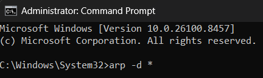
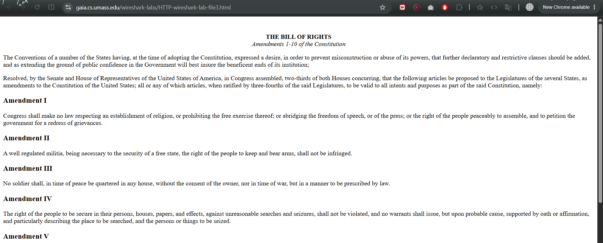
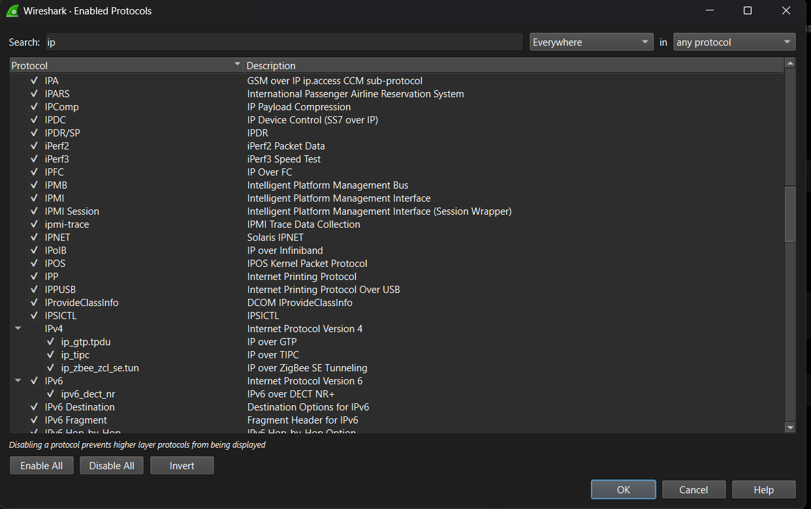
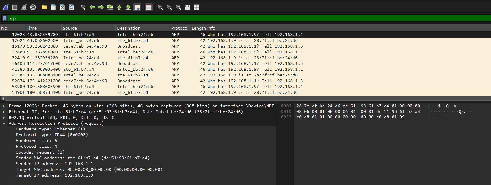

Nama: Adisty Fatika Ardani
NIM: 103072400091

---

# Modul 13 Ethernet and ARP

## Tujuan Praktikum
1. Mahasiswa dapat menginvestigasi cara kerja Ethernet dan ARP menggunakan Wireshark

---

## PENGANTAR

Pada modul ini dipelajari dua protokol penting di lapisan data link **Ethernet** dan **ARP** (*Address Resolution Protocol*). Ethernet adalah protokol yang mengatur cara data ditransmisikan antar perangkat dalam jaringan lokal menggunakan frame. ARP adalah protokol yang digunakan perangkat IP untuk mengetahui alamat MAC dari perangkat lain yang alamat IP-nya sudah diketahui. Tanpa ARP, perangkat tidak bisa mengirimkan frame Ethernet ke tujuan yang tepat meskipun sudah mengetahui IP-nya.

---

## MENANGKAP DAN MENGANALISIS FRAME ETHERNET

### Langkah 1: Membersihkan Cache Browser dan Menghapus Cache ARP

Sebelum memulai capture, cache browser dan cache ARP perlu dibersihkan agar semua proses komunikasi terjadi dari awal tanpa menggunakan data yang tersimpan. Cache ARP dihapus menggunakan Command Prompt dengan hak Administrator:

```
C:\Windows\System32> arp -d *
```

Berikut tampilan Command Prompt saat perintah `arp -d *` dijalankan:



Perintah `arp -d *` menghapus seluruh entri yang ada di cache ARP. Tanda `*` adalah wildcard yang berarti hapus semua bukan hanya satu entri tertentu. Ini penting agar saat mengakses URL, komputer benar-benar harus mengirimkan ARP Request untuk mengetahui alamat MAC gateway, sehingga proses ARP bisa tertangkap oleh Wireshark.

### Langkah 2: Mengakses URL dan Menangkap Paket

Jalankan Wireshark dan mulai capture, kemudian buka URL berikut di browser:

```
http://gaia.cs.umass.edu/wireshark-labs/HTTP-wireshark-lab-file3.html
```

Berikut tampilan halaman web yang berhasil diakses:



Halaman yang ditampilkan adalah **The Bill of Rights** dokumen konstitusi Amerika Serikat. Halaman ini cukup panjang sehingga membutuhkan beberapa segmen TCP untuk mengunduhnya, yang berarti lebih banyak frame Ethernet yang akan tertangkap.

### Langkah 3: Menonaktifkan IP di Wireshark

Setelah capture dihentikan, tampilan Wireshark diubah agar hanya menampilkan protokol di bawah lapisan IP. Caranya melalui menu **Analyze → Enabled Protocols**, kemudian cari protokol `ip` dan hilangkan centang pada **IPv4** dan **IPv6**.

Berikut tampilan jendela Enabled Protocols saat menonaktifkan IP:



Dengan menonaktifkan IPv4 dan IPv6, Wireshark tidak lagi menampilkan informasi protokol lapisan jaringan ke atas. Ini membuat analisis lebih fokus pada frame Ethernet dan ARP yang ada di lapisan data link.

---

## ADDRESS RESOLUTION PROTOCOL (ARP)

### Langkah 4: Menganalisis Paket ARP di Wireshark

Setelah IP dinonaktifkan, terapkan filter berikut di Wireshark untuk menampilkan hanya paket ARP:

```
arp
```

Berikut tampilan Wireshark setelah filter `arp` diterapkan:



Berdasarkan hasil capture di atas, terlihat pola ARP Request dan ARP Reply yang terjadi berulang. Paket nomor 12023 adalah **ARP Request** dari `zte_61:b7:a4` yang di-broadcast ke `Intel_be:24:d6` dengan pesan **"Who has 192.168.1.9? Tell 192.168.1.1"** artinya router dengan IP `192.168.1.1` sedang mencari tahu alamat MAC dari perangkat dengan IP `192.168.1.9`. Paket nomor 12024 adalah **ARP Reply** yang membalas dengan **"192.168.1.9 is at 28:7f:cf:be:24:d6"** perangkat dengan IP tersebut memberitahukan alamat MAC-nya.

Pada bagian packet-details window di bawahnya, terlihat detail lengkap paket ARP Request yang dipilih. **Hardware type: Ethernet (1)** menunjukkan ARP berjalan di atas jaringan Ethernet. **Protocol type: IPv4 (0x0800)** menunjukkan protokol jaringan yang digunakan. **Opcode: request (1)** menandakan ini adalah ARP Request, bukan Reply. **Sender MAC address** berisi alamat MAC pengirim (`dc:51:93:61:b7:a4`), **Sender IP address** berisi IP pengirim (`192.168.1.1`), **Target MAC address** berisi `00:00:00:00:00:00` karena alamat MAC tujuan memang belum diketahui itulah tujuan ARP Request ini, dan **Target IP address** berisi IP yang ingin diketahui alamat MAC-nya (`192.168.1.9`).

Terlihat juga paket dari `ce:e7:eb:5e:4e:98` yang melakukan broadcast **"Who has 192.168.1.1? Tell 192.168.1.3"** secara periodik ini adalah ARP Request dari perangkat lain di jaringan yang sama yang juga sedang mencari alamat MAC gateway. Pola ini normal terjadi di jaringan lokal karena entri ARP cache memiliki waktu kedaluwarsa dan harus diperbarui secara berkala.