Nama: Adisty Fatika Ardani
NIM: 103072400091

---

# Modul 14 802.11 WiFi

## BAGIAN A BEACON FRAME

### Langkah 1: Filter Beacon Frame

Buka file `Wireshark_802_11.pcap` di Wireshark, kemudian terapkan filter berikut untuk menampilkan hanya beacon frame:

```
wlan.fc.type_subtype == 0x08
```

Berikut tampilan Wireshark setelah filter beacon frame diterapkan:

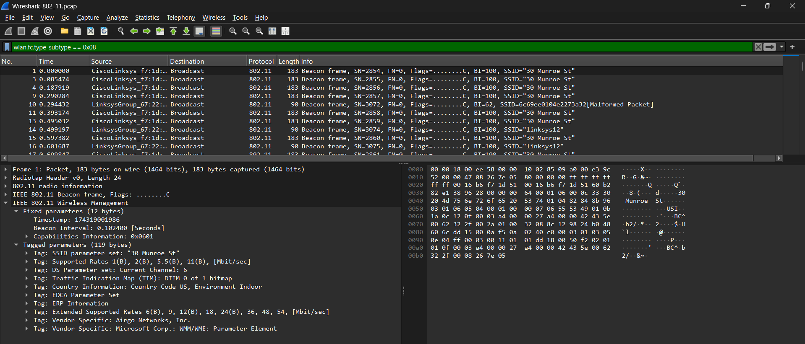

Dari packet-listing window terlihat beacon frame dikirim secara periodik oleh dua AP **CiscoLinksys_f7:1d:...** dengan SSID `30 Munroe St` dan **LinksysGroup_67:22:...** dengan SSID `linksys12`. Beacon frame selalu dikirim ke alamat **Broadcast** agar semua perangkat di sekitar bisa mendeteksi keberadaan AP tersebut.

### Langkah 2: Analisis Detail Beacon Frame

Klik salah satu beacon frame dari AP `30 Munroe St`, kemudian perluas bagian **IEEE 802.11 Wireless Management** pada packet-details window:

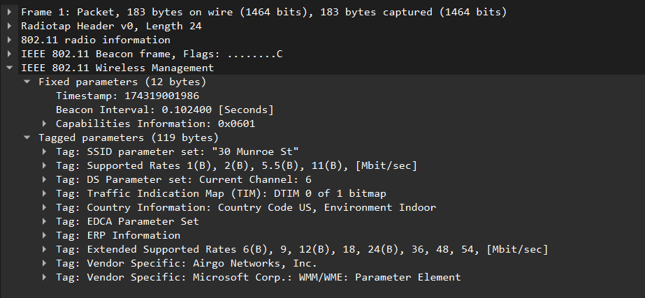

Berdasarkan detail paket di atas, informasi penting yang terdapat dalam beacon frame adalah sebagai berikut. **Timestamp: 174319001986** digunakan untuk sinkronisasi waktu antar perangkat di jaringan. **Beacon Interval: 0.102400 seconds** berarti AP mengirimkan beacon setiap 102.4ms ini adalah interval standar 100 Time Units. **SSID parameter set: "30 Munroe St"** adalah nama jaringan WiFi yang diiklankan. **DS Parameter Set: Current Channel: 6** menunjukkan AP beroperasi di channel 6. Supported Rates menampilkan kecepatan yang didukung mulai dari 1 hingga 11 Mbit/sec untuk 802.11b/g.

---

## BAGIAN B DATA TRANSFER

### Langkah 3: Mencari HTTP Request

Untuk menganalisis transfer data, digunakan filter berdasarkan IP address server `gaia.cs.umass.edu`:

```
ip.addr==128.119.245.12
```

Berikut tampilan Wireshark hasil filter transfer data HTTP:

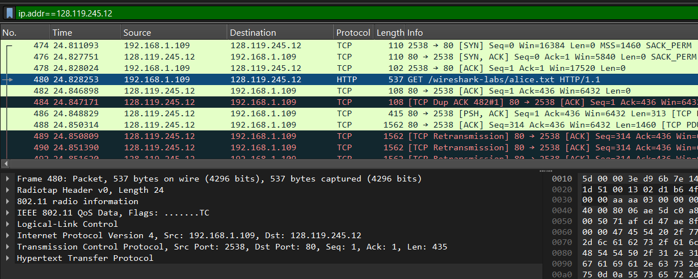

Pada waktu t=24.828253, terlihat paket nomor 480 berupa **HTTP GET /wireshark-labs/alice.txt HTTP/1.1** yang dikirim dari `192.168.1.109` ke `128.119.245.12`. Sebelumnya terlihat proses TCP three-way handshake (SYN → SYN,ACK → ACK) di paket 474–478 yang membangun koneksi sebelum HTTP request dikirim.

### Langkah 4: Analisis Alamat MAC pada Frame 802.11

Klik paket HTTP GET tersebut, kemudian perluas bagian **IEEE 802.11 QoS Data**:

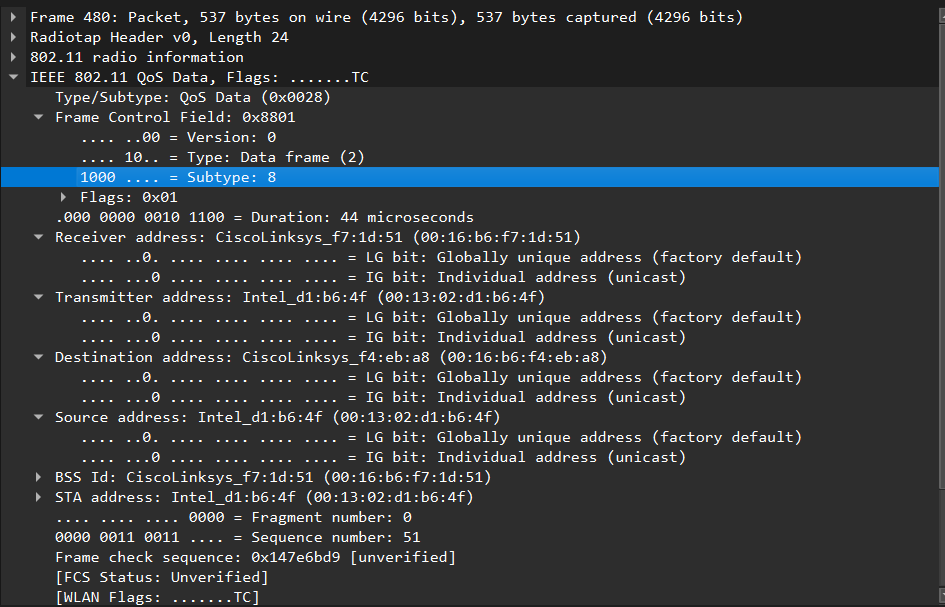

Terdapat empat alamat dalam frame 802.11 yang berbeda dari Ethernet biasa. **Receiver address: CiscoLinksys_f7:1d:51 (00:16:b6:f7:1d:51)** adalah AP yang akan menerima frame ini. **Transmitter address: Intel_d1:b6:4f (00:13:02:d1:b6:4f)** adalah host nirkabel yang mengirimkan frame. **Destination address: CiscoLinksys_f4:eb:a8 (00:16:b6:f4:eb:a8)** adalah tujuan akhir frame di sisi jaringan kabel. **Source address: Intel_d1:b6:4f (00:13:02:d1:b6:4f)** adalah host asal yang membuat data ini.

Berikut tampilan detail alamat MAC secara lengkap:

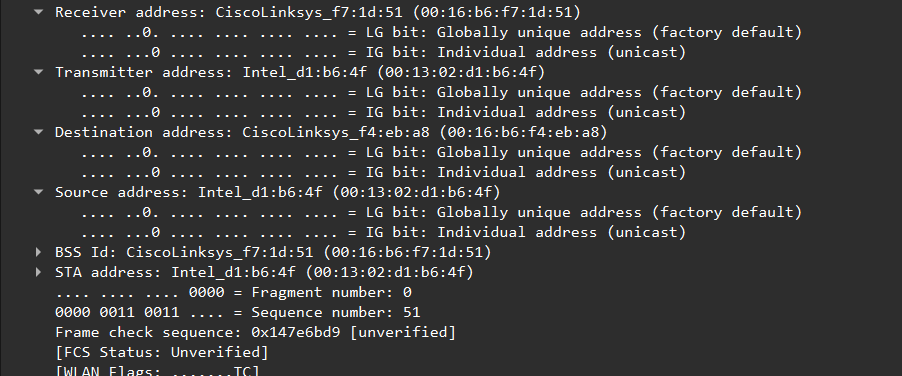

BSS Id dan STA address juga terlihat di sini BSS Id menunjukkan identitas AP (`CiscoLinksys_f7:1d:51`) sedangkan STA address menunjukkan station atau host nirkabel (`Intel_d1:b6:4f`).

---

## BAGIAN C ASSOCIATION DAN DISASSOCIATION

### Langkah 5: Association Request

Untuk melihat seluruh Association Request, gunakan filter:

```
wlan.fc.type==0 && wlan.fc.subtype==0
```

Berikut tampilan Association Request yang tertangkap:

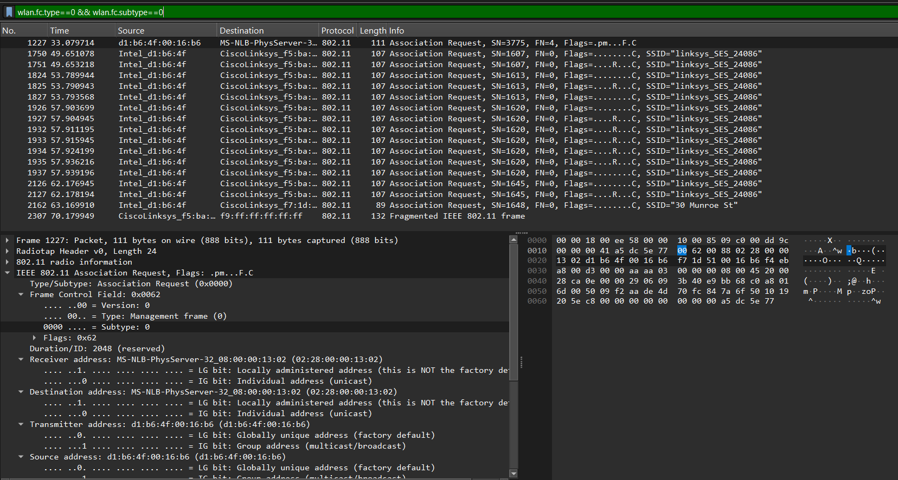

Terlihat host `Intel_d1:b6:4f` mengirimkan banyak Association Request ke `CiscoLinksys_f5:ba:...` dengan SSID `linksys_ses_24086` mulai sekitar t=49 detik. Request dikirim berulang kali karena tidak mendapat respons AP tersebut adalah jaringan tertutup yang tidak bisa diakses. Pada t=63.169910 terlihat Association Request ke AP berbeda yaitu `CiscoLinksys_f7:1d:...` dengan SSID `30 Munroe St` yang merupakan AP semula.

Berikut detail salah satu Association Request ke `linksys_ses_24086`:

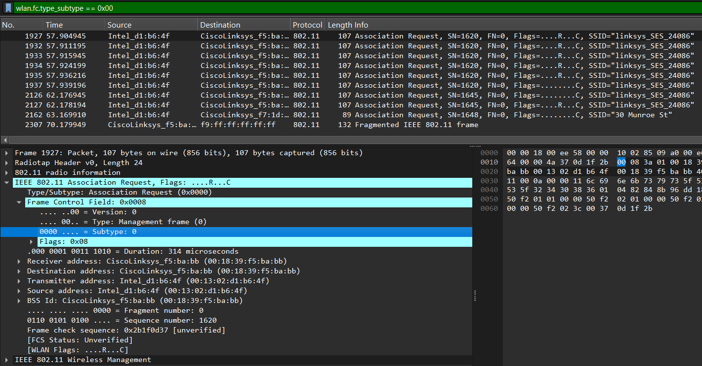

Pada detail frame terlihat **Type/Subtype: Association Request (0x0000)**, **Subtype: 0**, dan **Type: Management frame (0)**. Receiver address adalah MAC AP tujuan (`CiscoLinksys_f5:ba:bb`) dan Transmitter/Source address adalah MAC host (`Intel_d1:b6:4f`).

### Langkah 6: Association Response

Filter untuk melihat Association Response:

```
wlan.fc.type_subtype==0x01
```

Berikut tampilan Association Response yang tertangkap:

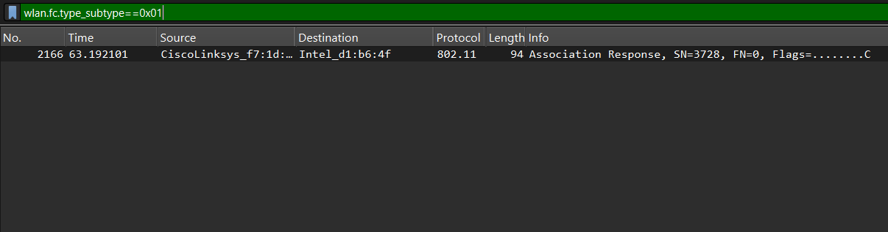

Hanya ada **satu** Association Response yang berhasil paket nomor 2166 pada t=63.192101 dari `CiscoLinksys_f7:1d:...` ke `Intel_d1:b6:4f`. Ini adalah respons dari AP `30 Munroe St` setelah host kembali berasosiasi.

Berikut detail Association Response yang berhasil:

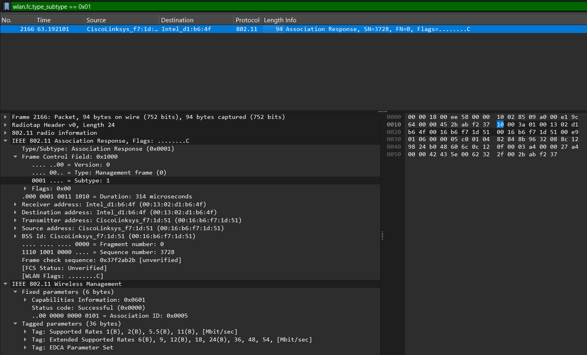

Pada detail terlihat **Type/Subtype: Association Response (0x0001)**, **Status code: Successful (0x0000)**, dan **Association ID: 0x0005**. Status code Successful menandakan asosiasi berhasil. Tidak ada Association Response dari `linksys_ses_24086` karena AP tersebut menolak atau tidak merespons permintaan host.

### Langkah 7: Authentication

Filter untuk melihat frame Authentication:

```
wlan.fc.type_subtype==0x0b
```

Berikut tampilan frame Authentication yang tertangkap:

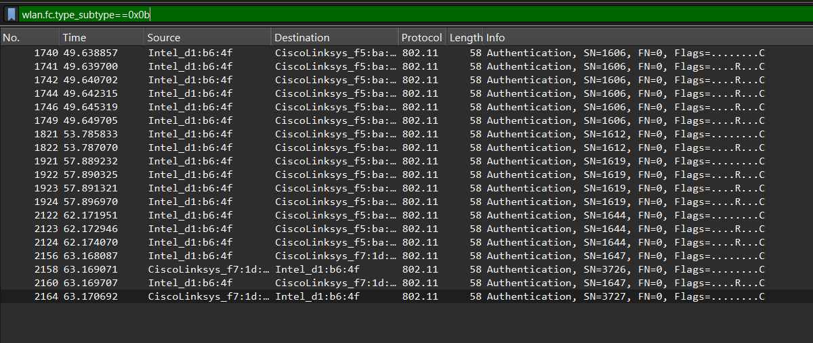

Frame Authentication terlihat mulai t=49.638857 saat host mencoba terhubung ke `linksys_ses_24086`. Detail pada frame 1740 menunjukkan **Type/Subtype: Authentication (0x000b)** dan **Subtype: 11**. Authentication dikirim dari host ke AP sebelum Association Request ini adalah urutan yang benar dalam proses koneksi WiFi. Pada t=63.168087 dan t=63.170692 terlihat Authentication ke AP `CiscoLinksys_f7:1d:...` (AP `30 Munroe St`) yang berhasil, ditandai dengan adanya Authentication Response balik dari AP ke host.

### Langkah 8: Deauthentication dan Proses Pindah AP

Filter untuk melihat frame Deauthentication:

```
wlan.fc.type_subtype==0x0c
```

Berikut tampilan frame Deauthentication beserta proses perpindahan AP:

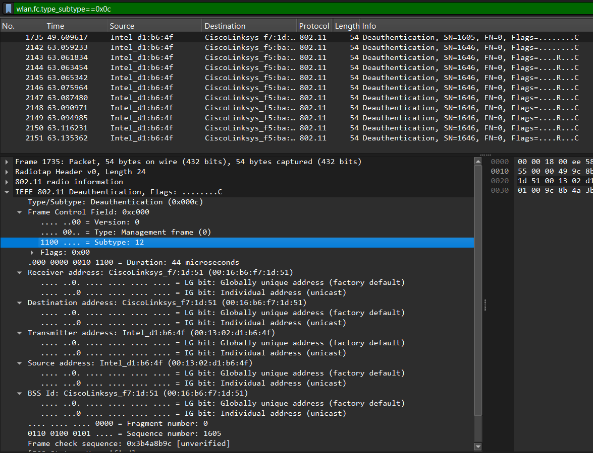

Frame pertama dengan nomor 1735 pada t=49.609617 adalah **Deauthentication** dari host `Intel_d1:b6:4f` ke AP `CiscoLinksys_f7:1d:51` (AP `30 Munroe St`). **Subtype: 12** pada Frame Control Field mengkonfirmasi ini adalah frame Deauthentication. Ini adalah tanda bahwa host secara resmi memutuskan koneksi dari AP lama sebelum mencoba bergabung ke AP baru.

Berikut tampilan keseluruhan proses perpindahan AP dengan filter `wlan.fc.type == 0`:

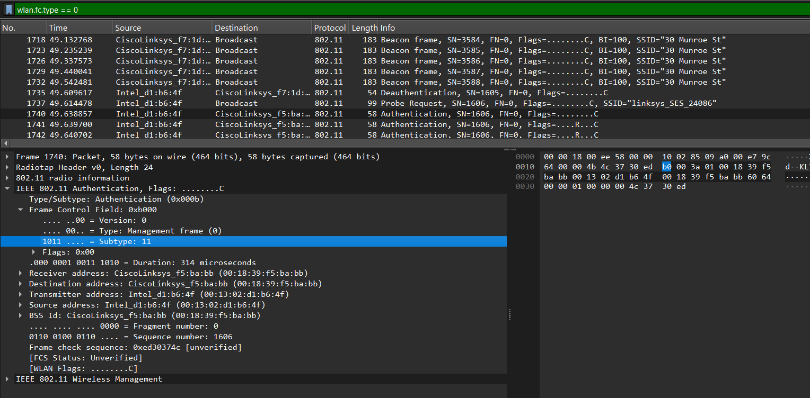

Alur perpindahan AP terlihat jelas setelah Deauthentication di t=49.609, host mengirim Probe Request ke SSID `linksys_ses_24086` di t=49.614, diikuti serangkaian Authentication dan Association Request yang tidak mendapat balasan sukses. Pada t=63.169 host akhirnya menyerah dan kembali mengirim Association Request ke AP `30 Munroe St`, yang langsung direspons dengan Association Response sukses di t=63.192.