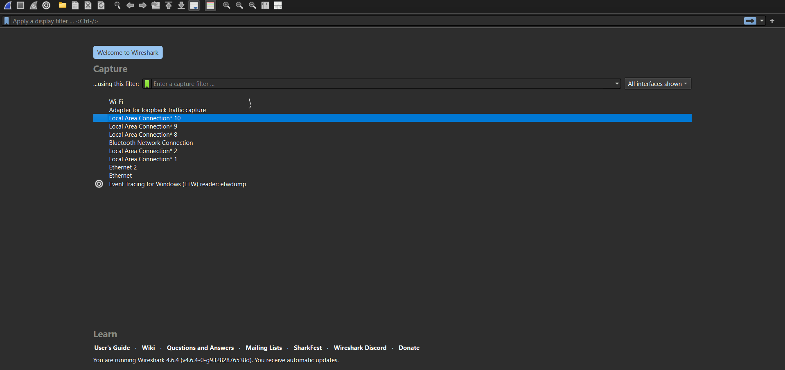
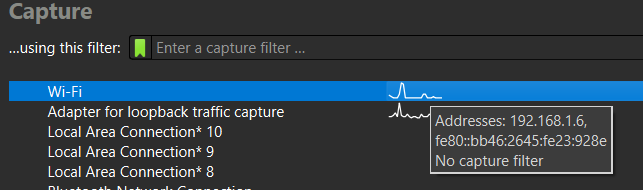
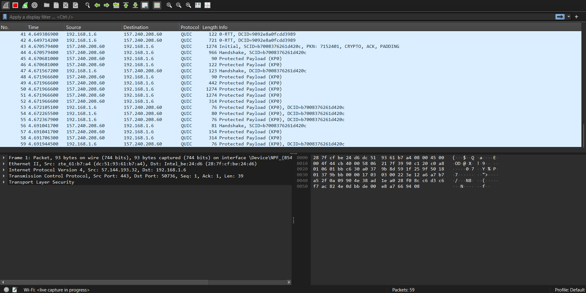
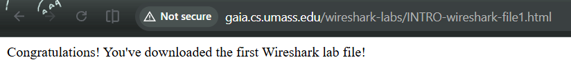
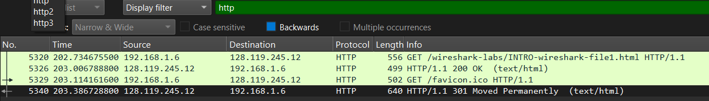
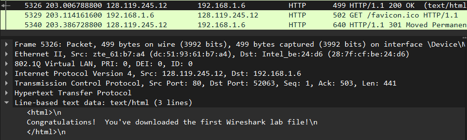

Nama: Adisty Fatika Ardani
NIM: 103072400091

---

# Modul 2 Pengenalan Tools

## Tujuan Praktikum
1. Mahasiswa dapat melakukan instalasi tool yang digunakan (Wireshark)
2. Mahasiswa dapat menggunakan tool (Wireshark) untuk menangkap dan mengidentifikasi paket data


---

## WIRESHARK

Wireshark adalah *network protocol analyzer* gratis yang berjalan di sistem operasi Windows, Mac, dan Linux/Unix. Wireshark terdiri dari dua komponen utama, yaitu **Packet Capture Library** yang menangkap semua frame pada link layer, dan **Packet Analyzer** yang menampilkan isi dari berbagai bidang dalam pesan protokol yang tertangkap.

Untuk menjalankan Wireshark, komputer harus memiliki akses ke library **libpcap** atau **WinPcap**. Library ini akan otomatis terinstall bersamaan dengan proses instalasi Wireshark.

---

## MENJALANKAN WIRESHARK

### Langkah 1: Membuka Wireshark

Jalankan Wireshark pada komputer. Saat pertama kali dibuka, akan muncul tampilan awal Wireshark seperti pada gambar di bawah ini. Versi Wireshark yang berbeda dapat memiliki tampilan awal yang sedikit berbeda.



### Langkah 2: Memilih Interface

Pada bagian **Capture**, terdapat daftar *interfaces* yang tersedia di komputer. Interface ini merupakan antarmuka jaringan yang digunakan komputer untuk terhubung ke jaringan, seperti Wi-Fi atau Ethernet. Pilih interface yang sedang aktif digunakan disini kita akan menggunakan wifi, kemudian klik dua kali untuk memulai pengambilan paket.



### Langkah 3: Memulai Capture Paket

Setelah memilih interface, Wireshark akan langsung mulai menangkap semua paket yang dikirim dan diterima oleh komputer melalui interface tersebut. Tampilan jendela Wireshark saat melakukan capture paket akan berubah dan menampilkan daftar paket yang tertangkap secara real-time seperti pada gambar di bawah ini.



Antarmuka Wireshark memiliki lima komponen utama yang perlu dipahami:

- **Command Menu:** menu pull-down standar di bagian atas jendela. Menu *File* digunakan untuk menyimpan atau membuka file hasil capture, sedangkan menu *Capture* digunakan untuk memulai dan menghentikan pengambilan paket.
- **Packet-Listing Window:** menampilkan ringkasan satu baris untuk setiap paket yang tertangkap, mencakup nomor paket, waktu, alamat sumber dan tujuan, jenis protokol, serta informasi spesifik protokol. Daftar paket dapat diurutkan berdasarkan salah satu kategori tersebut dengan mengklik nama kolom.
- **Packet-Header Details Window:** menampilkan detail lengkap dari paket yang dipilih pada packet-listing window, mencakup informasi frame Ethernet, datagram IP, segmen TCP/UDP, hingga pesan protokol lapisan aplikasi. Jumlah informasi yang ditampilkan dapat diperluas atau diminimalkan dengan mengklik tanda **+** atau **-** di sebelah kiri tiap baris.
- **Packet-Contents Window:** menampilkan seluruh isi frame yang ditangkap dalam format ASCII maupun heksadesimal, sehingga memungkinkan analisis data mentah dari paket yang tertangkap.
- **Packet Display Filter Field:** kolom di bagian atas antarmuka yang digunakan untuk menyaring paket berdasarkan nama protokol atau kriteria tertentu. Contohnya, mengetikkan `http` akan menyebabkan hanya paket HTTP saja yang ditampilkan pada packet-listing window.

### Langkah 4: Menghentikan Capture Paket

Untuk menghentikan pengambilan paket, pilih menu **Capture → Stop** atau klik tombol kotak merah pada toolbar Wireshark. Setelah dihentikan, seluruh paket yang telah tertangkap dapat dianalisis lebih lanjut.

---

## MENGGUNAKAN WIRESHARK UNTUK TEST RUN

### Langkah 1: Menjalankan Browser dan Wireshark

Pastikan komputer terhubung ke internet melalui antarmuka Ethernet atau WiFi. Jalankan browser web terlebih dahulu, kemudian jalankan Wireshark. Pada tahap ini Wireshark belum mulai menangkap paket.

### Langkah 2: Memulai Capture Paket

Untuk memulai pengambilan paket, pilih menu **Capture → Interfaces** pada Wireshark. Akan muncul jendela **Wireshark: Capture Interfaces** yang menampilkan daftar interface beserta jumlah paket yang telah diamati. Pilih interface yang aktif kemudian klik **Start** untuk memulai pengambilan paket.

### Langkah 3: Membuka URL di Browser

Saat Wireshark sedang berjalan dan menangkap paket, buka browser dan akses URL berikut:

```
http://gaia.cs.umass.edu/wireshark-labs/INTRO-wireshark-file1.html
```



Browser akan menghubungi server HTTP di `gaia.cs.umass.edu` dan bertukar pesan HTTP untuk mengunduh halaman tersebut. Seluruh frame yang berisi pesan HTTP ini akan tertangkap oleh Wireshark.

### Langkah 4: Menghentikan Capture

Setelah halaman berhasil ditampilkan di browser, hentikan pengambilan paket pada Wireshark dengan memilih **Capture → Stop**. Pada jendela utama Wireshark kini akan tampil seluruh paket yang berhasil ditangkap selama proses browsing berlangsung.

### Langkah 5: Menggunakan Display Filter

Ketikkan `http` pada kolom **display filter** di bagian atas jendela Wireshark, kemudian tekan **Enter** atau klik **Apply**. Hal ini akan menyaring tampilan sehingga hanya menampilkan paket HTTP saja dan menyembunyikan paket protokol lainnya.



### Langkah 6: Menganalisis Paket HTTP GET

Temukan pesan **HTTP GET** yang dikirim dari komputer ke server `gaia.cs.umass.edu` pada daftar paket yang tertangkap. Klik paket tersebut untuk melihat detail informasi yang mencakup frame Ethernet, datagram IP, segmen TCP, dan header pesan HTTP pada jendela detail paket di bawahnya. Gunakan tombol **+** dan **-** untuk memperluas atau meminimalkan informasi tiap protokol yang ditampilkan.



### Langkah 7: Keluar dari Wireshark

Setelah selesai menganalisis paket, keluar dari Wireshark.