Nama: Adisty Fatika Ardani
NIM: 103072400091

---

# Modul 3 HTTP

## Tujuan Praktikum
1. Mahasiswa dapat menginvestigasi cara kerja protokol HTTP menggunakan Wireshark


---

## BASIC HTTP GET/RESPONSE INTERACTION

### Langkah 1: Menyiapkan Browser dan Wireshark

Jalankan browser web, kemudian jalankan Wireshark. Pada kolom display filter di bagian atas jendela Wireshark, ketikkan `http` agar hanya pesan HTTP saja yang ditampilkan pada packet-listing window.

### Langkah 2: Memulai Capture dan Membuka URL

Tunggu sebentar, kemudian mulai pengambilan paket pada Wireshark. Buka browser dan akses URL berikut:

```
http://gaia.cs.umass.edu/wireshark-labs/HTTP-wireshark-file1.html
```

Berikut tampilan halaman web yang berhasil diakses:

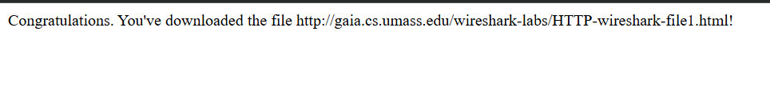

### Langkah 3: Menghentikan Capture dan Menganalisis Paket

Setelah halaman berhasil ditampilkan, hentikan pengambilan paket pada Wireshark. Jendela Wireshark akan menampilkan dua pesan HTTP yang tertangkap, yaitu pesan GET dari browser ke server dan pesan respons dari server ke browser.

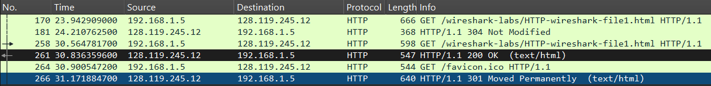

Berikut hasil analisis paket HTTP yang tertangkap:

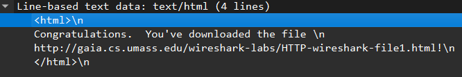

---

## HTTP CONDITIONAL GET/RESPONSE INTERACTION

Sebagian besar browser melakukan *caching* objek sehingga sering melakukan conditional GET saat mengambil objek HTTP. Conditional GET terjadi ketika browser mengirimkan header `If-Modified-Since` untuk menanyakan apakah konten di server telah berubah sejak terakhir diunduh.

### Langkah 1: Membersihkan Cache Browser

Sebelum memulai, pastikan cache dan history browser telah dibersihkan agar browser tidak menggunakan data yang tersimpan dari sesi sebelumnya.

### Langkah 2: Memulai Capture dan Membuka URL

Mulai pengambilan paket pada Wireshark, kemudian akses URL berikut:

```
http://gaia.cs.umass.edu/wireshark-labs/HTTP-wireshark-file2.html
```

Berikut tampilan halaman web yang berhasil diakses:

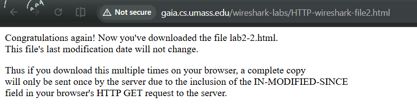

### Langkah 3: Mengakses URL yang Sama Kembali

Setelah halaman ditampilkan, masukkan kembali URL yang sama atau tekan tombol **Refresh** pada browser. Hal ini akan memicu browser untuk mengirimkan conditional GET dengan header `If-Modified-Since` ke server.

### Langkah 4: Menghentikan Capture dan Menganalisis Paket

Hentikan pengambilan paket pada Wireshark, kemudian pastikan filter `http` aktif. Amati perbedaan antara pesan HTTP GET pertama dan kedua yang tertangkap.

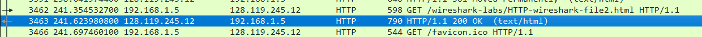

Berikut hasil analisis paket conditional GET yang tertangkap:

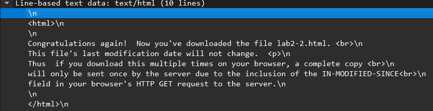

---

## RETRIEVING LONG DOCUMENTS

Pada percobaan ini kita akan mengamati apa yang terjadi ketika browser mengunduh file HTML yang panjang dan tidak dapat dimuat dalam satu paket TCP.

### Langkah 1: Membersihkan Cache Browser

Pastikan cache dan history browser telah dibersihkan sebelum memulai percobaan.

### Langkah 2: Memulai Capture dan Membuka URL

Mulai pengambilan paket pada Wireshark, kemudian akses URL berikut:

```
http://gaia.cs.umass.edu/wireshark-labs/HTTP-wireshark-file3.html
```

Berikut tampilan halaman web yang berhasil diakses:

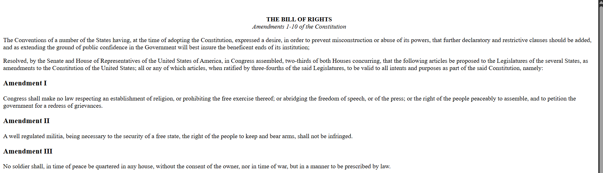

### Langkah 3: Menghentikan Capture dan Menganalisis Paket

Hentikan pengambilan paket pada Wireshark. Pada packet-listing window akan terlihat pesan HTTP GET diikuti oleh respons TCP multi-paket. Hal ini terjadi karena file HTML berukuran lebih dari 4500 byte sehingga terlalu besar untuk dimuat dalam satu paket TCP dan dipecah menjadi beberapa segmen yang ditandai sebagai **"TCP segment of a reassembled PDU"**.

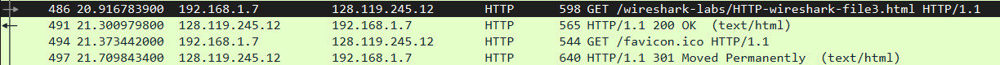

Berikut hasil analisis paket multi-segmen TCP yang tertangkap:

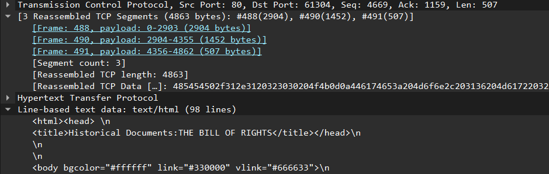

---

## HTML DOCUMENTS DENGAN EMBEDDED OBJECTS

Pada percobaan ini kita akan mengamati apa yang terjadi ketika browser mengunduh file HTML yang di dalamnya terdapat objek lain seperti gambar yang disimpan di server lain.

### Langkah 1: Membersihkan Cache Browser

Pastikan cache dan history browser telah dibersihkan sebelum memulai percobaan.

### Langkah 2: Memulai Capture dan Membuka URL

Mulai pengambilan paket pada Wireshark, kemudian akses URL berikut:

```
http://gaia.cs.umass.edu/wireshark-labs/HTTP-wireshark-file4.html
```

Berikut tampilan halaman web yang berhasil diakses beserta dua gambar yang termuat di dalamnya:

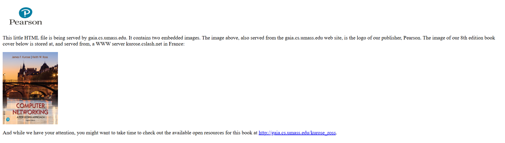

### Langkah 3: Menghentikan Capture dan Menganalisis Paket

Hentikan pengambilan paket pada Wireshark dan aktifkan filter `http`. Amati bahwa browser mengirimkan beberapa pesan HTTP GET secara terpisah satu untuk file HTML utama dan satu untuk masing-masing gambar yang direferensikan di dalamnya.

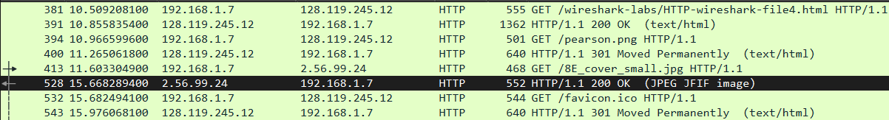

Berikut hasil analisis paket HTTP GET untuk embedded objects yang tertangkap:

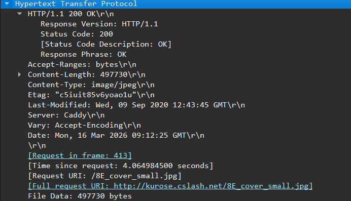

---

## HTTP AUTHENTICATION

Pada percobaan terakhir ini kita akan mengunjungi halaman web yang dilindungi kata sandi dan mengamati urutan pesan HTTP yang terjadi, termasuk bagaimana username dan password dikirimkan melalui jaringan.

### Langkah 1: Membersihkan Cache Browser

Pastikan cache dan history browser telah dibersihkan sebelum memulai percobaan.

### Langkah 2: Memulai Capture dan Membuka URL

Mulai pengambilan paket pada Wireshark, kemudian akses URL berikut:

```
http://gaia.cs.umass.edu/wireshark-labs/protected_pages/HTTP-wireshark-file5.html
```

Berikut tampilan halaman login yang muncul saat mengakses URL tersebut:

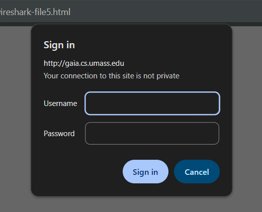

### Langkah 3: Memasukkan Kredensial

Masukkan username dan password berikut pada kotak pop-up yang muncul:
- **Username** : `wireshark-students`
- **Password** : `network`

Berikut tampilan halaman web setelah berhasil login:

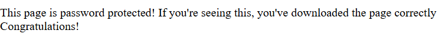

### Langkah 4: Menghentikan Capture dan Menganalisis Paket

Hentikan pengambilan paket pada Wireshark dan aktifkan filter `http`. Amati urutan pesan HTTP yang terjadi browser pertama kali mendapatkan respons `401 Unauthorized`, kemudian mengirimkan ulang request dengan header `Authorization: Basic` yang berisi kredensial dalam format Base64.

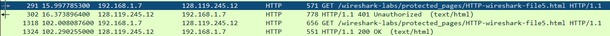

Berikut hasil analisis paket HTTP Authentication yang tertangkap:

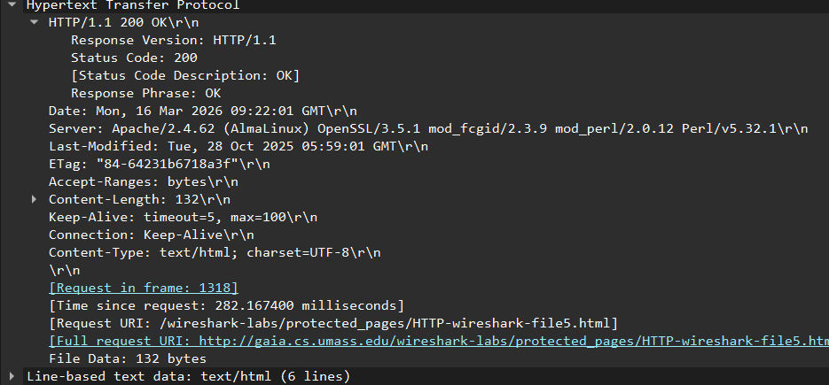

### Langkah 5: Decode Kredensial Base64

Username dan password yang dikirimkan tidak dienkripsi, melainkan hanya dikodekan dalam format **Base64**. Untuk membuktikannya, kita dapat melakukan decode pada string Base64 yang tertangkap di Wireshark menggunakan situs decoder online.

Berikut tampilan halaman decoder Base64 yang digunakan:

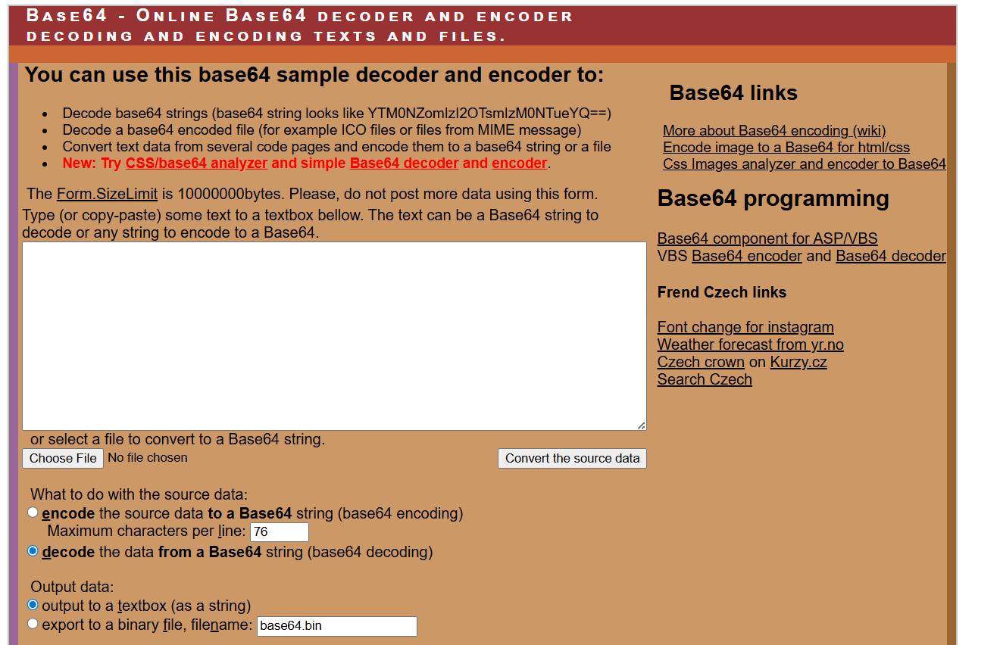

Masukkan string Base64 berikut ke dalam kolom input decoder:

```
d2lyZXNoYXJrLXN0dWRlbnRz
```

Berikut tampilan input string Base64 pada decoder:

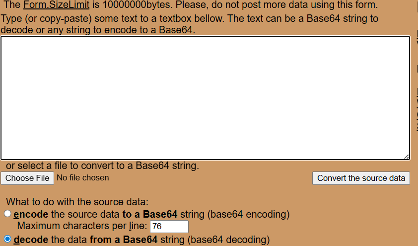

Setelah menekan tombol decode, berikut hasil decode yang diperoleh:

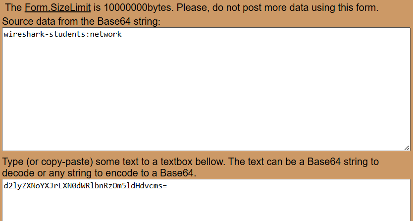
Hasil decode menunjukkan bahwa string tersebut adalah **`wireshark-students`**, yang merupakan username yang digunakan untuk login.