Nama: Adisty Fatika Ardani
NIM: 103072400091

---

# Modul 4 DNS

## Tujuan Praktikum
1. Mahasiswa dapat menginvestigasi cara kerja DNS menggunakan Wireshark

---

## PENGANTAR

Domain Name System (DNS) memiliki peran penting dalam infrastruktur internet karena berfungsi mentranslasikan nama host ke bentuk alamat IP. Pada modul ini, kita akan mempelajari lebih lanjut sisi klien DNS. Perlu diingat bahwa peran klien dalam DNS relatif sederhana klien hanya mengirimkan permintaan ke server DNS lokal dan menerima respons balik. Banyak hal yang terjadi "di balik layar" tidak terlihat oleh klien DNS karena server DNS hirarkis berkomunikasi satu sama lain untuk menyelesaikan permintaan klien secara rekursif maupun iteratif.

---

## 4.2 NSLOOKUP

`nslookup` adalah perintah yang tersedia pada sebagian besar platform Linux/Unix maupun Windows. Perintah ini memungkinkan host untuk mengirimkan permintaan DNS ke server tertentu dan mendapatkan informasi DNS dari server tersebut. Untuk menjalankan `nslookup` di Linux/Unix, cukup ketik perintah tersebut pada terminal. Untuk Windows, buka Command Prompt dan ketik `nslookup` pada baris perintah.

Sintaks umum perintah `nslookup` adalah sebagai berikut:

```
nslookup –option1 –option2 host-to-find dns-server
```

Secara umum, `nslookup` dapat dijalankan dengan nol, satu, dua, atau lebih opsi. Pengisian nama `dns-server` juga bersifat opsional jika tidak diisi, permintaan akan dikirim ke default server DNS lokal.

#### Perintah 1 Mendapatkan Alamat IP Host

```
nslookup www.mit.edu
```

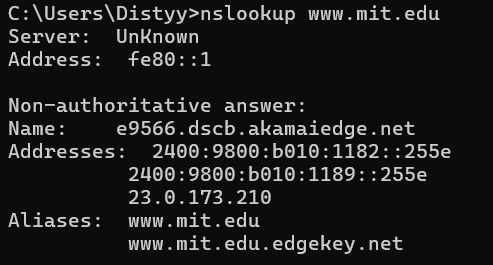

Perintah ini berarti "tolong kirimkan alamat IP untuk host `www.mit.edu`". Jawaban yang diperoleh menyediakan dua informasi, yaitu: (1) nama dan alamat IP server DNS yang memberikan jawaban; dan (2) nama host beserta alamat IP dari `www.mit.edu`. Meskipun jawaban berasal dari server DNS lokal di Polytechnic University, terdapat kemungkinan bahwa server DNS lokal ini menghubungi beberapa server DNS lain secara iteratif untuk mendapatkan jawaban tersebut.

#### Perintah 2 Mendapatkan Server DNS Otoritatif | BENERIN LAGI

```
nslookup -type=NS mit.edu
```

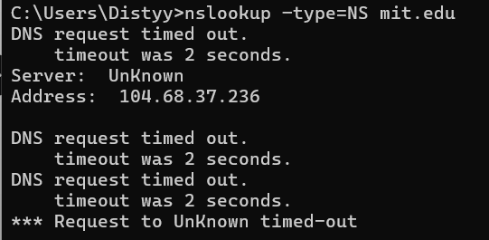

Pada perintah ini, opsi `-type=NS` digunakan untuk meminta record bertipe NS ke default server DNS lokal, yang berarti "tolong kirimkan nama host dari DNS otoritatif untuk `mit.edu`". Ketika opsi `-type` tidak digunakan, `nslookup` secara default akan mengakses record tipe A. Hasil yang diperoleh menampilkan tiga nama server DNS otoritatif MIT beserta alamat IP-nya. Perlu diperhatikan bahwa hasil tersebut bersifat **non-otoritatif**, artinya jawaban berasal dari cache server perantara, bukan langsung dari server DNS otoritatif MIT. Server DNS lokal juga secara otomatis menyertakan alamat IP dari server DNS otoritatif MIT meskipun tidak diminta secara eksplisit.

#### Perintah 3 Mengirimkan Permintaan ke Server DNS Tertentu

```
nslookup www.aiit.or.kr bitsy.mit.edu
```

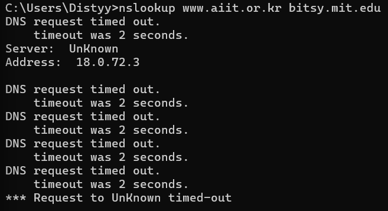

Pada perintah ini, permintaan dikirimkan langsung ke server DNS `bitsy.mit.edu`, bukan ke default server DNS lokal. Dengan demikian, pertukaran informasi terjadi secara langsung antara host yang mengajukan permintaan dan `bitsy.mit.edu`. Hasilnya, server DNS tersebut memberikan alamat IP dari host `www.aiit.or.kr`, yang merupakan server web milik Advanced Institute of Information Technology di Korea.

---

### Percobaan 1 Mendapatkan Alamat IP Server Web di Asia

Perintah yang digunakan untuk mendapatkan alamat IP dari server web di Asia adalah sebagai berikut:

```
nslookup google.com
```

Berikut tampilan hasil perintah tersebut pada Command Prompt:

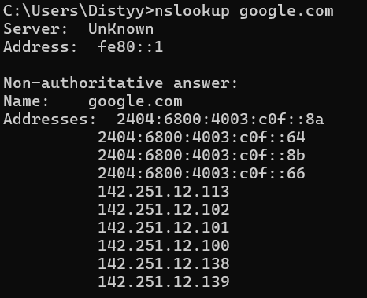

Hasil yang diperoleh menunjukkan bahwa domain `google.com` memiliki beberapa alamat IP, yaitu `142.251.12.113`, `142.251.12.102`, `142.251.12.101`, `142.251.12.100`, `142.251.12.138`, dan `142.251.12.139`. Selain alamat IPv4, terdapat pula alamat IPv6 yang dikembalikan oleh server DNS, namun yang umum digunakan adalah alamat IPv4 di atas.

---

### Percobaan 2 Mengetahui Server DNS Otoritatif untuk Suatu Domain

Untuk mengetahui server DNS otoritatif dari suatu domain, digunakan opsi `-type=NS` pada perintah `nslookup`. Perintah yang digunakan adalah sebagai berikut:

```
nslookup -type=NS google.com
```

Berikut tampilan hasil perintah tersebut pada Command Prompt:

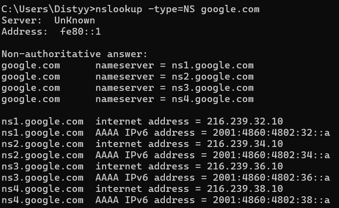

Hasil yang diperoleh menunjukkan bahwa domain `google.com` memiliki empat server DNS otoritatif, yaitu `ns1.google.com`, `ns2.google.com`, `ns3.google.com`, dan `ns4.google.com`. Keempat server tersebut merupakan server DNS yang bertanggung jawab untuk menjawab permintaan resolusi nama pada domain `google.com`.

---

### Percobaan 3 Mengetahui Server Email Yahoo! Mail

Untuk mengetahui informasi server email (mail exchanger) dari Yahoo! Mail, digunakan opsi `-type=MX` pada perintah `nslookup`. Perintah yang digunakan adalah sebagai berikut:

```
nslookup -type=MX yahoo.com
```

Berikut tampilan hasil perintah tersebut pada Command Prompt:

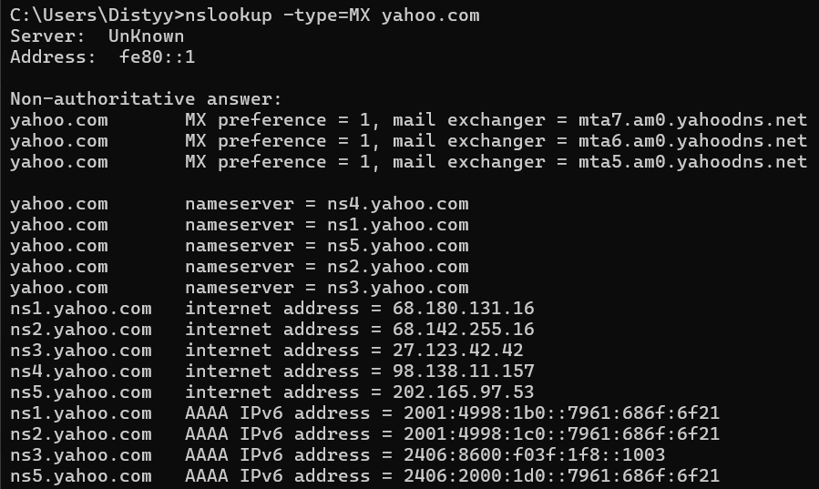

Hasil yang diperoleh menunjukkan bahwa Yahoo! Mail menggunakan tiga server email, yaitu `mta5.am0.yahoodns.net`, `mta6.am0.yahoodns.net`, dan `mta7.am0.yahoodns.net`. Adapun alamat IP dari ketiga server tersebut adalah `98.138.11.157`, `27.123.42.42`, dan `202.165.97.53`.

---

## 4.3 IPCONFIG

`ipconfig` (untuk Windows) dan `ifconfig` (untuk Linux/Unix) adalah salah satu fasilitas yang paling berguna di dalam host, terutama untuk men-debug masalah jaringan. Pada bagian ini, pembahasan akan difokuskan pada `ipconfig`. Meskipun begitu, `ifconfig` pada Linux/Unix tidak jauh berbeda dalam hal fungsi dan penggunaannya.

`ipconfig` dapat digunakan untuk menampilkan informasi mengenai konfigurasi TCP/IP yang sedang aktif, termasuk alamat IP, alamat server DNS, jenis adaptor, dan sebagainya.

---

### Menampilkan Informasi TCP/IP

Untuk memperoleh semua informasi tentang host, masukkan perintah berikut ke dalam Command Prompt:

```
ipconfig /all
```

Berikut tampilan hasil perintah tersebut pada Command Prompt:

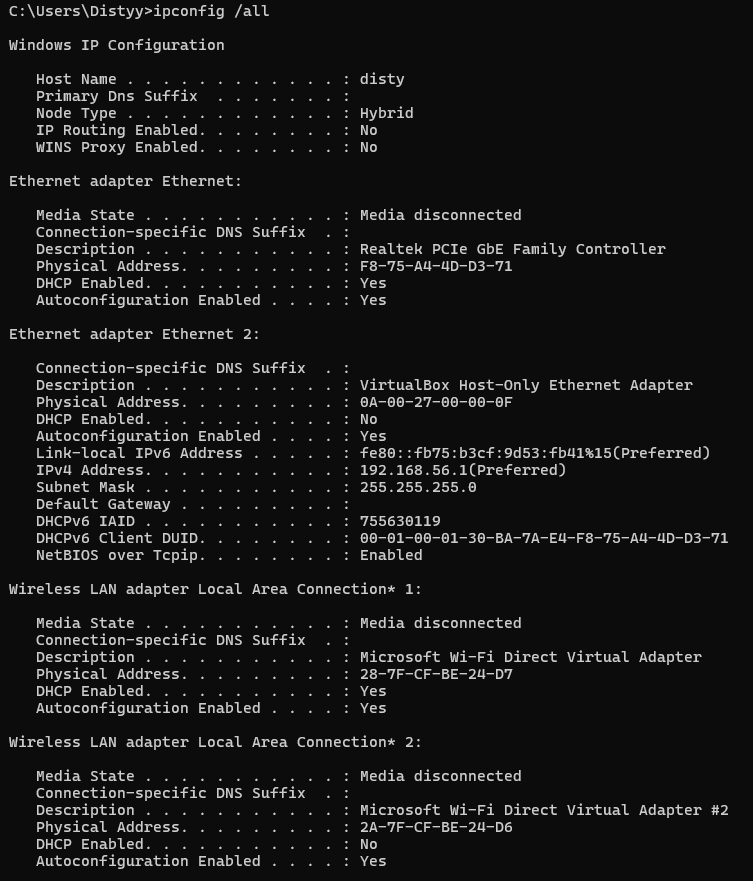

Hasil yang diperoleh menampilkan seluruh informasi konfigurasi TCP/IP pada host, mencakup alamat IP, subnet mask, default gateway, alamat server DNS, jenis adaptor jaringan, dan informasi lainnya yang berkaitan dengan koneksi jaringan yang sedang aktif.

---

### Menampilkan Cache DNS

`ipconfig` juga sangat berguna untuk mengelola informasi DNS yang tersimpan dalam host. Sebuah host dapat menyimpan catatan DNS yang baru saja diperolehnya sebagai cache. Untuk melihat record DNS yang sedang tersimpan beserta sisa waktu hidupnya, masukkan perintah berikut:

```
ipconfig /displaydns
```

Berikut tampilan hasil perintah tersebut pada Command Prompt:

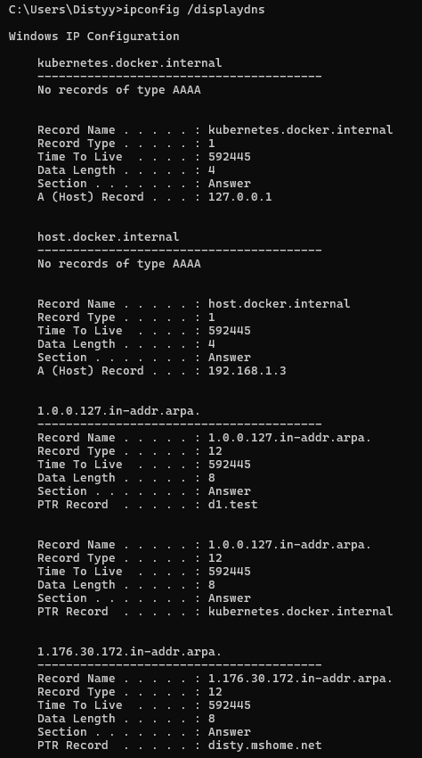

Hasil yang ditampilkan mencakup record DNS yang tersimpan dalam cache beserta nilai **Time To Live (TTL)** dalam satuan detik, yaitu waktu yang menunjukkan berapa lama record tersebut masih dianggap valid sebelum perlu diperbarui.

---

### Menghapus Cache DNS

Untuk menghapus seluruh catatan DNS yang tersimpan dalam cache, masukkan perintah berikut:

```
ipconfig /flushdns
```

Berikut tampilan hasil perintah tersebut pada Command Prompt:

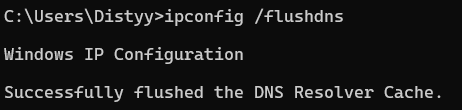

Mengosongkan cache DNS berarti menghapus semua record yang tersimpan dan memuat ulang record dari file host. Hal ini berguna ketika terdapat perubahan pada record DNS suatu domain dan host perlu memperoleh informasi terbaru dari server DNS.

## 4.4 TRACING DNS DENGAN WIRESHARK

Setelah mengenal `nslookup` dan `ipconfig`, pada bagian ini kita akan melakukan analisis yang lebih mendalam dengan menangkap dan mengamati paket DNS secara langsung menggunakan Wireshark.

---

### Langkah-Langkah Persiapan

Sebelum memulai pengambilan paket, lakukan beberapa persiapan berikut:

1. Gunakan `ipconfig /flushdns` untuk mengosongkan cache DNS pada host.

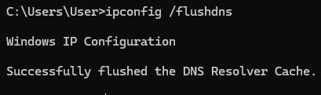

2. Buka browser dan kosongkan cache-nya. Pada Internet Explorer, buka menu **Tools** → **Internet Options** → tab **General** → pilih **Delete Files**.
3. Buka Wireshark dan masukkan filter berikut pada kolom display filter, dengan `<your IP address>` diisi menggunakan alamat IP host yang diperoleh melalui `ipconfig`:

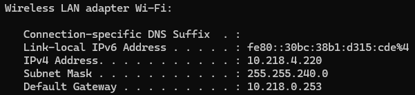

```
ip.addr == <your IP address>
```

Filter ini akan menyembunyikan semua paket yang tidak berasal atau ditujukan ke host.

4. Mulai pengambilan paket pada Wireshark.
5. Buka browser dan kunjungi halaman web berikut:

```
http://www.ietf.org
```

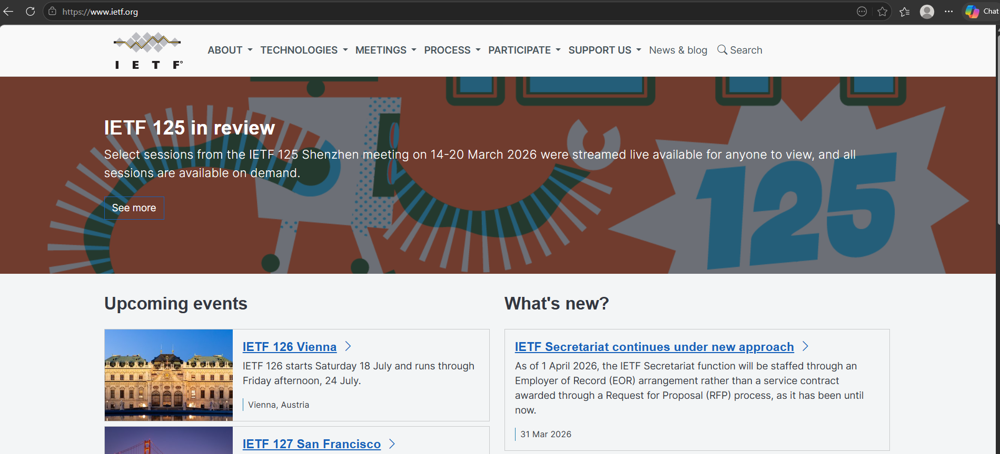

6. Setelah halaman berhasil dimuat, hentikan pengambilan paket.

---

### Analisis Paket DNS www.ietf.org

#### Pertanyaan 1 Protokol yang Digunakan

Berdasarkan hasil pengamatan pada Wireshark, paket DNS request dan response tampak sebagai **Standard query** dan **Standard query response**. Pesan-pesan tersebut dikirimkan menggunakan protokol **UDP (User Datagram Protocol)**.

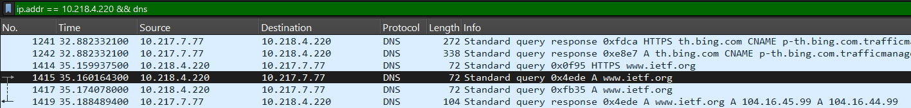

#### Pertanyaan 2 Port Tujuan dan Port Sumber

Port tujuan pada pesan permintaan DNS adalah **53**, yang merupakan port standar untuk layanan DNS. Port sumber pada pesan balasan DNS juga adalah **53**, karena balasan dikirim oleh server DNS menggunakan port yang sama.

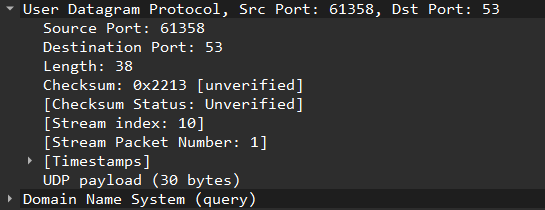

#### Pertanyaan 3 Alamat IP Tujuan dan Server DNS Lokal

Alamat IP tujuan pada pesan permintaan DNS adalah **10.217.7.77**. Alamat tersebut merupakan server DNS lokal yang digunakan oleh host. Dengan demikian, alamat IP tujuan pada paket DNS dan alamat IP server DNS lokal adalah **sama**.

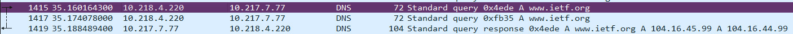

#### Pertanyaan 4 Type dan Isi DNS Request

Tipe dari pesan permintaan DNS adalah **A**, yang digunakan untuk meminta alamat IPv4 dari suatu domain. Pesan permintaan DNS tidak mengandung jawaban, ditunjukkan dengan nilai **Answers = 0**, karena pesan ini hanya berupa permintaan ke server DNS.

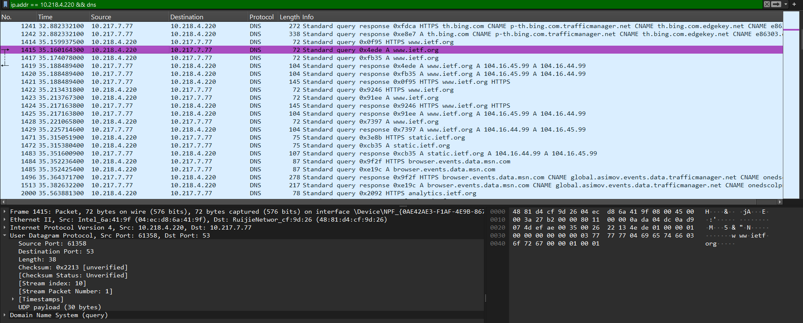

#### Pertanyaan 5 Isi Jawaban pada DNS Response

Pada pesan balasan DNS terdapat **2 buah answers**. Isi dari masing-masing jawaban tersebut adalah alamat IP dari domain `www.ietf.org`, yaitu `104.16.45.99` dan `104.16.44.99`. Kedua jawaban tersebut merupakan record bertipe **A (IPv4)**.

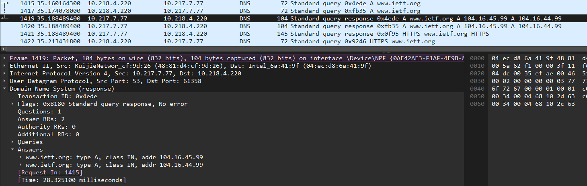

#### Pertanyaan 6 Kesesuaian IP pada Paket TCP SYN

Filter yang digunakan untuk melihat paket TCP SYN:

```
tcp.flags.syn == 1 && ip.src == 10.218.4.220 && (ip.dst == 104.16.44.99 || ip.dst == 104.16.45.99)
```

Alamat IP pada paket TCP SYN sesuai dengan alamat IP yang diperoleh dari balasan DNS, yaitu **104.16.44.99**. Hal ini menunjukkan bahwa host menggunakan hasil resolusi DNS untuk melakukan koneksi ke server tujuan.

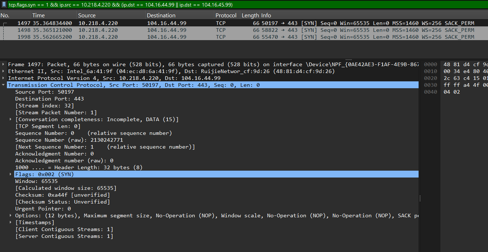

#### Pertanyaan 7 Kebutuhan DNS untuk Setiap Akses Gambar

Filter yang digunakan:

```
ip.src == 10.218.4.220 && (ip.dst == 104.16.44.99 || ip.dst == 104.16.45.99) && tcp
```

Host **tidak perlu** mengirimkan permintaan DNS baru setiap kali mengakses gambar pada halaman web. Hal ini terlihat dari hasil capture Wireshark, di mana terdapat banyak koneksi TCP ke alamat IP yang sama tanpa adanya permintaan DNS baru. Alamat IP yang telah diperoleh dari resolusi DNS sebelumnya disimpan dalam cache dan digunakan kembali tanpa perlu melakukan resolusi ulang.

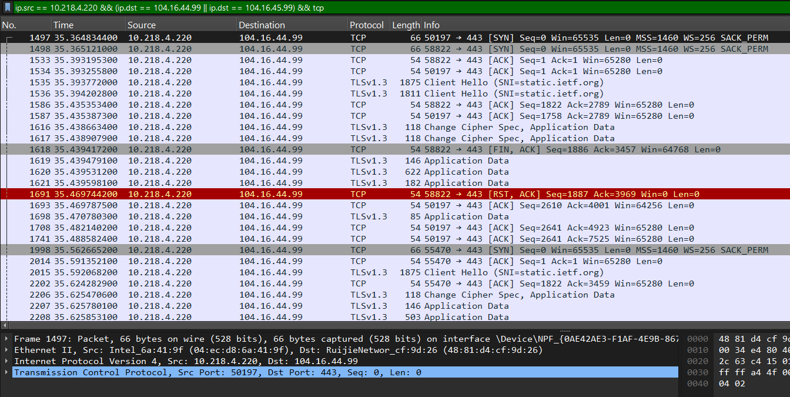

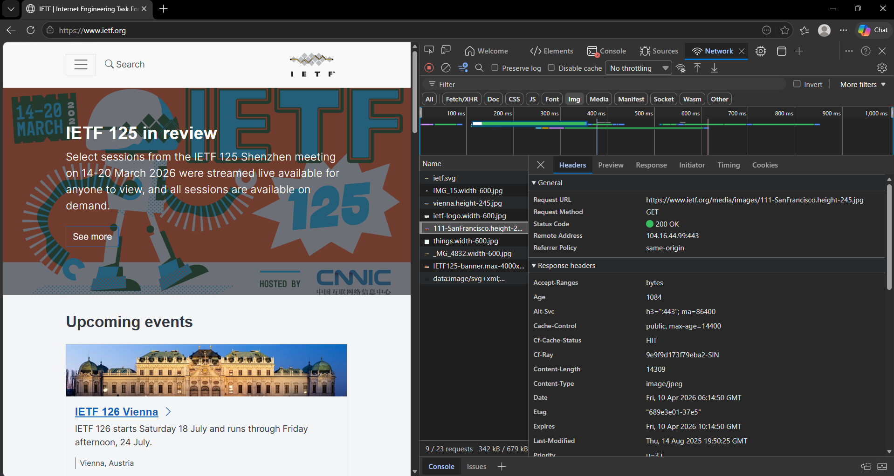

---

### Analisis Paket DNS nslookup www.mit.edu

Selanjutnya, lakukan pengambilan paket DNS yang dihasilkan dari perintah `nslookup`. Langkah-langkahnya adalah sebagai berikut:

1. Mulai pengambilan paket pada Wireshark.
2. Jalankan perintah berikut pada Command Prompt:

```
nslookup www.mit.edu
```

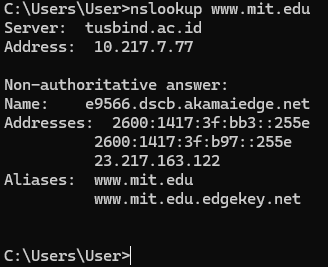

3. Hentikan pengambilan paket.


Pada hasil capture dapat dilihat bahwa `nslookup` sebenarnya mengirimkan tiga pesan permintaan DNS dan menerima tiga pesan balasan. Dalam menjawab pertanyaan berikut, abaikan dua pasangan permintaan-balasan pertama karena merupakan paket khusus yang dihasilkan oleh `nslookup`. Fokus hanya pada pesan permintaan dan balasan terakhir.

#### Pertanyaan 1 Port Tujuan dan Port Sumber

Port tujuan pada pesan permintaan DNS adalah **53**, sedangkan port sumber pada pesan balasan DNS juga adalah **53**. Hal ini karena server DNS menggunakan port standar 53 untuk komunikasi.

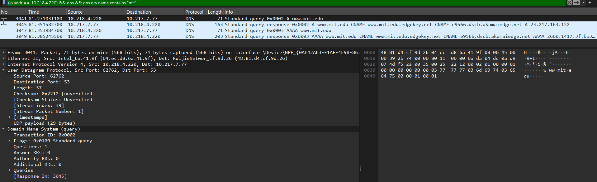

#### Pertanyaan 2 Alamat IP Tujuan DNS

Pesan permintaan DNS dikirim ke alamat IP **10.217.7.77**, yang merupakan server DNS lokal yang digunakan oleh host. Alamat tersebut sesuai dengan default server DNS lokal.

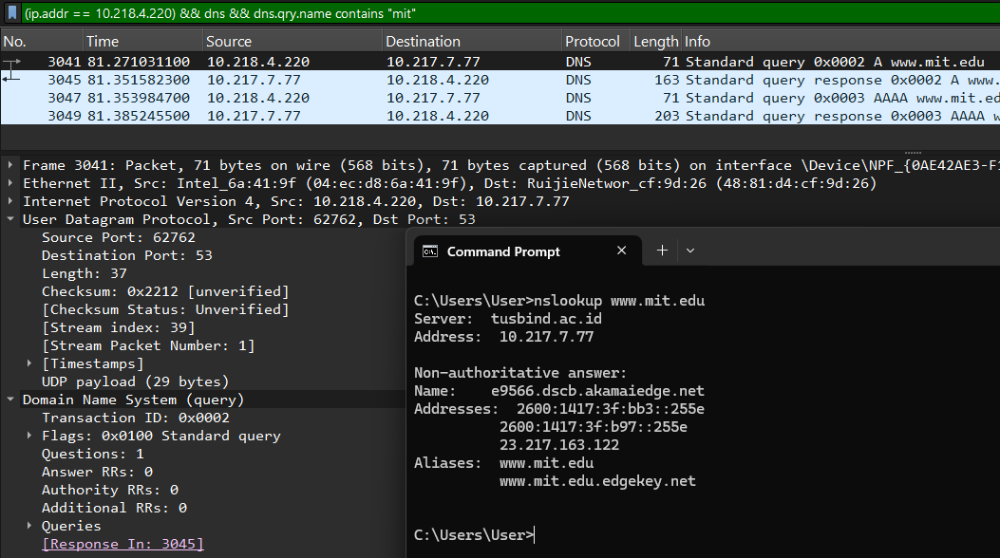

#### Pertanyaan 3 Type dan Isi DNS Request

Tipe dari pesan permintaan DNS adalah **A**, yang digunakan untuk meminta alamat IPv4 dari domain `www.mit.edu`. Pesan tersebut tidak mengandung jawaban, ditunjukkan dengan nilai **Answer RRs = 0**, karena hanya berupa permintaan ke server DNS.

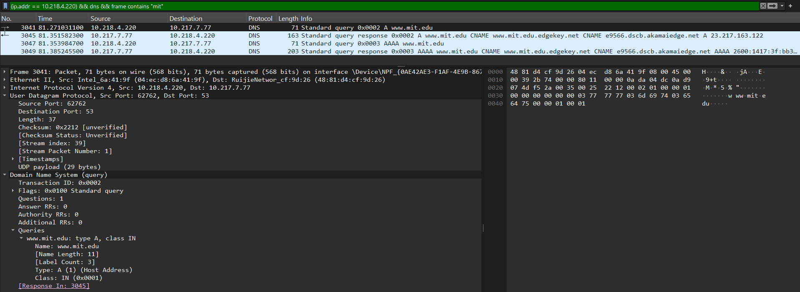

#### Pertanyaan 4 Isi DNS Response

Pesan balasan DNS mengandung beberapa jawaban, yaitu:

- **Record CNAME**: `www.mit.edu` → `www.mit.edu.edgekey.net` → `e9566.dscb.akamaiedge.net`
- **Record A (IPv4)**: `23.217.163.122`
- **Record AAAA (IPv6)**: `2600:1417:3f:bb3::255e`

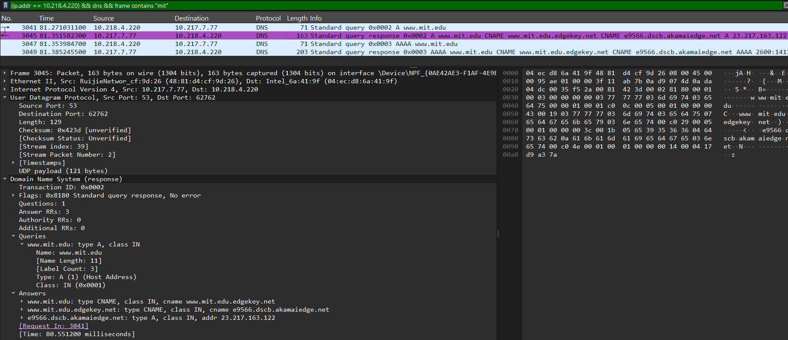

#### Pertanyaan 5 Screenshot Hasil Tangkapan

Berikut tangkapan layar yang menunjukkan pesan DNS request (Standard query A www.mit.edu), pesan DNS response, serta bagian Answers yang berisi record CNAME, A, dan AAAA:


---

### Analisis Paket DNS nslookup -type=NS mit.edu

Ulangi percobaan sebelumnya menggunakan perintah berikut:

```
nslookup -type=NS mit.edu
```

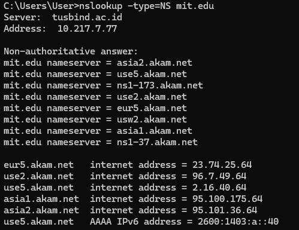

#### Pertanyaan 1 Alamat IP Tujuan DNS

Pesan permintaan DNS dikirim ke alamat IP **10.217.7.77**, yang merupakan server DNS lokal yang digunakan oleh host. Alamat tersebut sesuai dengan default server DNS lokal.

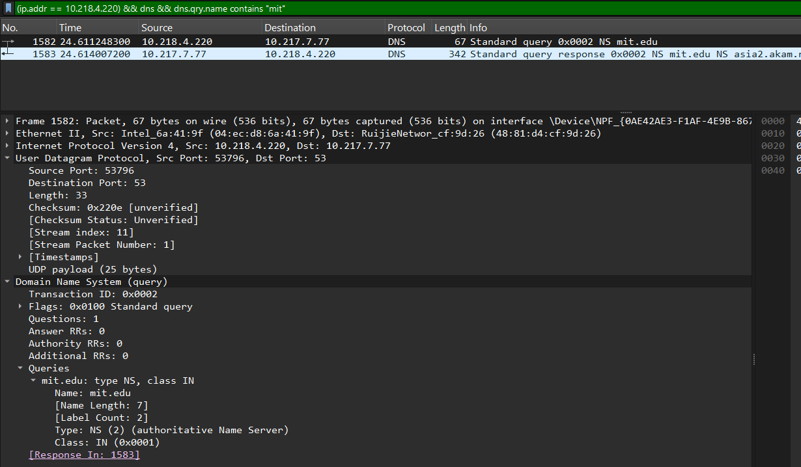

#### Pertanyaan 2 Type dan Isi DNS Request

Tipe dari pesan permintaan DNS adalah **NS**, yang digunakan untuk meminta informasi name server dari domain `mit.edu`. Pesan tersebut tidak mengandung jawaban, ditunjukkan dengan nilai **Answer RRs = 0**, karena hanya berupa permintaan ke server DNS.


#### Pertanyaan 3 Name Server MIT pada DNS Response

Pesan balasan DNS memberikan informasi mengenai name server dari domain `mit.edu`, yaitu `asia2.akam.net`, `use5.akam.net`, `ns1-173.akam.net`, `use2.akam.net`, `eur5.akam.net`, `usw2.akam.net`, `asia1.akam.net`, dan `ns1-37.akam.net`.

Selain itu, pesan balasan juga menyertakan alamat IP dari beberapa server tersebut pada bagian **additional records**, yaitu `23.74.25.64`, `96.7.49.64`, `2.16.40.64`, `95.100.175.64`, dan `95.101.36.64`, serta alamat IPv6 `2600:1403:a::40`.

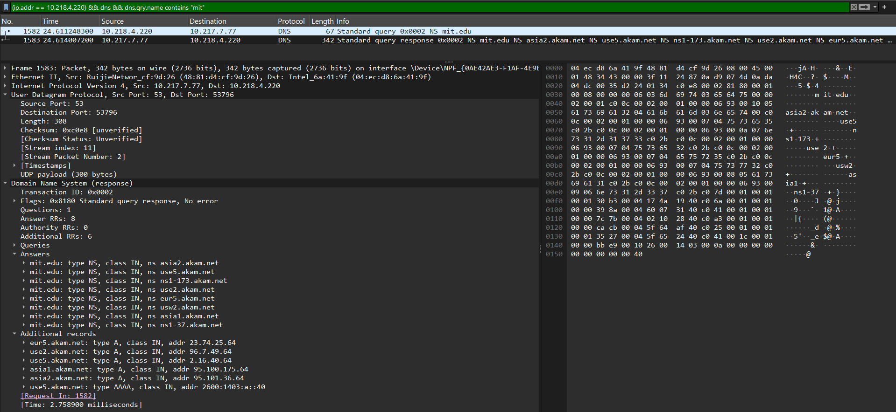

---

### Analisis Paket DNS nslookup www.aiit.or.kr bitsy.mit.edu

Ulangi percobaan dengan mengirimkan permintaan ke server DNS tertentu menggunakan perintah berikut:

```
nslookup www.aiit.or.kr bitsy.mit.edu
```

Berikut tampilan Wireshark setelah pengambilan paket selesai dilakukan:

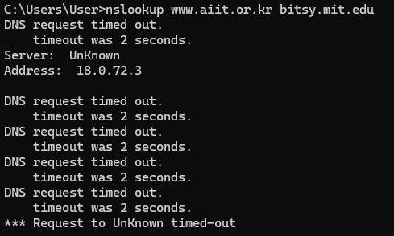

#### Pertanyaan 1 Alamat IP Tujuan DNS

Pesan permintaan DNS dikirim ke alamat IP **18.0.72.3**, yang merupakan alamat IP dari server DNS `bitsy.mit.edu` yang ditentukan secara manual. Alamat tersebut **bukan** merupakan default server DNS lokal yang sebelumnya digunakan oleh host.

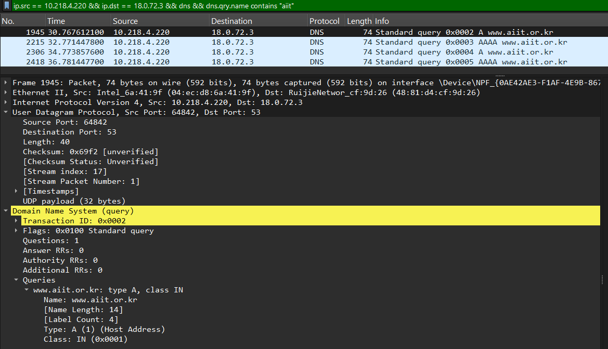

#### Pertanyaan 2 Type dan Isi DNS Request

Tipe dari pesan permintaan DNS adalah **A**, yang digunakan untuk meminta alamat IPv4 dari domain `www.aiit.or.kr`. Pesan tersebut tidak mengandung jawaban, ditunjukkan dengan nilai **Answer RRs = 0**, karena hanya berupa permintaan ke server DNS.


#### Pertanyaan 3 Isi DNS Response

Pesan balasan DNS tidak diterima karena terjadi **timeout** pada server DNS yang digunakan. Oleh karena itu, tidak terdapat jawaban yang dapat dianalisis dari hasil percobaan ini. Hal ini juga terlihat pada tampilan Command Prompt yang menampilkan pesan **DNS request timed out**.

