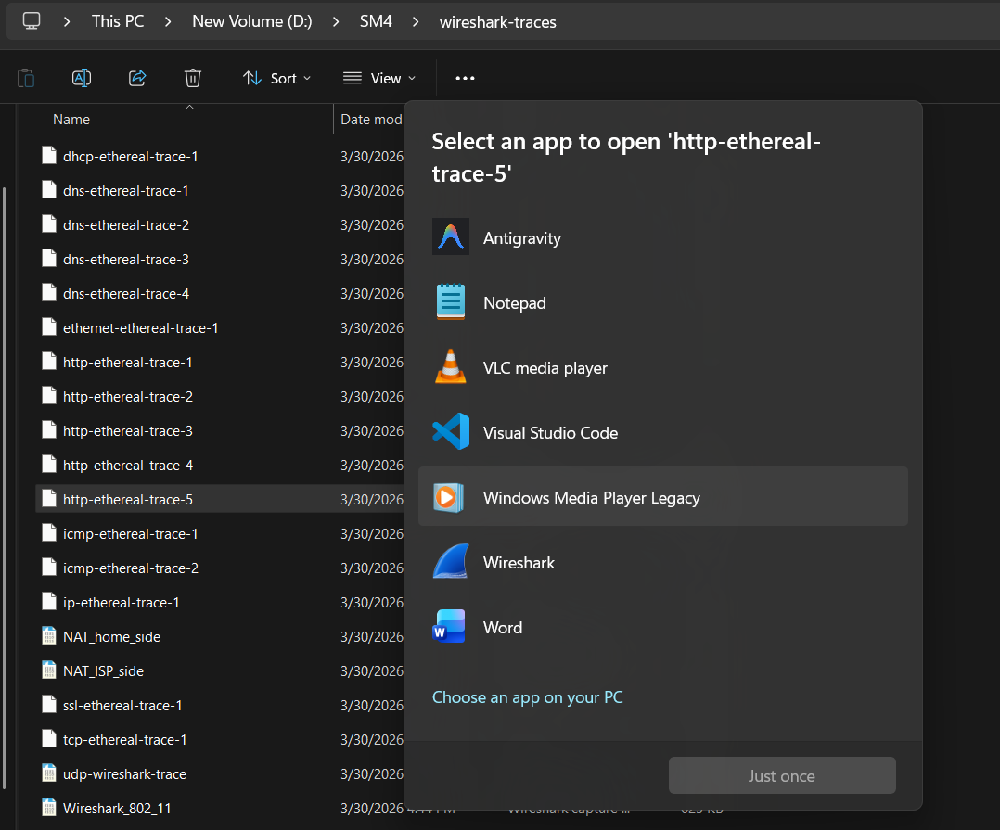
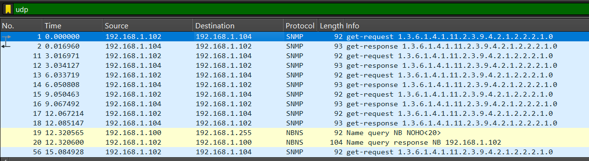
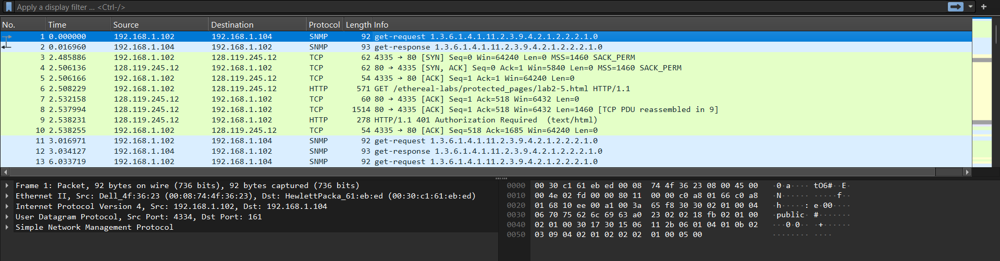
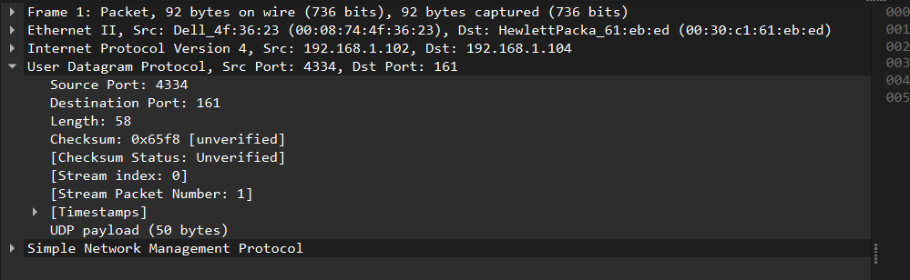
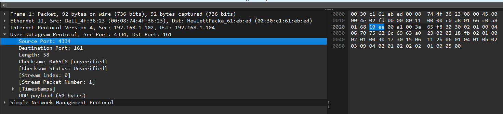
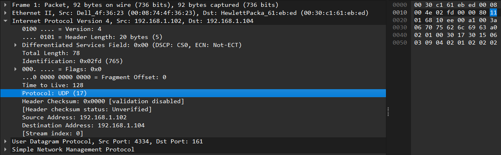

Nama: Adisty Fatika Ardani
NIM: 103072400091

---

# Modul 5 UDP

## Tujuan Praktikum
1. Mahasiswa dapat menginvestigasi cara kerja protokol UDP menggunakan Wireshark

---

## PENGANTAR

Pada modul ini, kita akan melihat sekilas protokol transport UDP. UDP adalah protokol yang sederhana dan tidak rumit. Pada tahap ini, mahasiswa sudah dianggap mahir menggunakan Wireshark sehingga langkah-langkah pengerjaan tidak akan dijelaskan secara eksplisit seperti pada modul sebelumnya.

---

## 5.2 TUGAS

Mulailah menangkap paket di Wireshark, kemudian lakukan sesuatu yang akan menyebabkan host mengirim dan menerima beberapa paket UDP. Terkadang, tanpa melakukan apapun, beberapa paket UDP yang dikirimkan oleh pihak lain akan terekam dalam trace. Secara khusus, Simple Network Management Protocol (SNMP) mengirimkan pesan di dalam UDP sehingga beberapa pesan SNMP beserta paket UDP-nya dapat ditemukan di dalam trace.

Setelah menghentikan pengambilan paket, atur filter agar Wireshark hanya menampilkan paket UDP yang dikirimkan dan diterima oleh host. Pilih salah satu paket UDP kemudian perluas field-nya pada bagian detail.

Berikut tampilan Wireshark setelah pengambilan paket selesai dilakukan:

Berikut tampilan detail paket UDP yang dipilih untuk dianalisis:

---

### Pertanyaan 1 Jumlah dan Nama Field pada Header UDP

Berdasarkan hasil pengamatan pada bagian **User Datagram Protocol** di Wireshark, header UDP terdiri dari **empat field utama**, yaitu:

- Source Port
- Destination Port
- Length
- Checksum

Keempat field tersebut merupakan komponen standar dari header UDP yang digunakan untuk mengidentifikasi sumber dan tujuan komunikasi, panjang data, serta pemeriksaan kesalahan pada data yang dikirimkan.

---

### Pertanyaan 2 Panjang Masing-Masing Field Header UDP

Berdasarkan pengamatan pada setiap field di dalam header UDP, diketahui bahwa masing-masing field memiliki panjang yang sama, yaitu **2 byte**. Rinciannya adalah sebagai berikut:

- Source Port: 2 byte
- Destination Port: 2 byte
- Length: 2 byte
- Checksum: 2 byte

Dengan demikian, total panjang header UDP adalah 2 + 2 + 2 + 2 = **8 byte**. Hal ini menunjukkan bahwa UDP memiliki struktur header yang sederhana dan berukuran tetap (*fixed size*), berbeda dengan TCP yang memiliki header lebih kompleks.

---

### Pertanyaan 3 Nilai Field Length dan Verifikasinya

Field **Length** pada header UDP menunjukkan total panjang dari keseluruhan segmen UDP, yang mencakup header dan data (payload). Berdasarkan hasil pengamatan pada paket yang dipilih, diperoleh informasi sebagai berikut:

- Nilai Length = 58 byte
- Panjang header UDP = 8 byte
- Panjang payload = 50 byte

Verifikasi: 8 byte (header) + 50 byte (payload) = **58 byte**

Hasil tersebut sesuai dengan nilai Length yang tertera pada paket. Dengan demikian, dapat disimpulkan bahwa field Length merepresentasikan total panjang segmen UDP, termasuk header dan payload.

---

### Pertanyaan 4 Jumlah Maksimum Byte pada Payload UDP

Untuk menentukan ukuran maksimum payload UDP, perlu diperhatikan bahwa field Length memiliki ukuran 2 byte atau 16 bit, sehingga nilai maksimum yang dapat direpresentasikan adalah **65.535 byte**. Namun, nilai tersebut mencakup seluruh bagian UDP termasuk header. Karena panjang header UDP adalah 8 byte, maka maksimum payload yang dapat dibawa oleh UDP adalah:

65.535 − 8 = **65.527 byte**

Dengan demikian, maksimum data yang dapat dikirim dalam satu segmen UDP adalah 65.527 byte.

---

### Pertanyaan 5 Nomor Port Terbesar sebagai Port Sumber

Field port pada UDP, baik Source Port maupun Destination Port, memiliki panjang 2 byte atau 16 bit. Dengan demikian, nilai maksimum yang dapat direpresentasikan adalah:

2¹⁶ − 1 = **65.535**

Hal ini berarti nomor port terbesar yang dapat digunakan sebagai port sumber adalah **65.535**. Rentang port pada UDP berada pada interval 0 hingga 65.535.

---

### Pertanyaan 6 Nomor Protokol untuk UDP

Berdasarkan hasil pengamatan pada bagian **Internet Protocol** di Wireshark, terlihat informasi protokol yang digunakan adalah UDP dengan nomor protokol sebagai berikut:

- Nilai desimal = **17**
- Nilai heksadesimal = **0x11**

Nilai ini menunjukkan bahwa dalam header IP, protokol UDP diidentifikasi dengan angka 17.

---

### Pertanyaan 7 Hubungan Nomor Port pada Paket Request dan Response

Berdasarkan hasil pengamatan terhadap pasangan paket UDP (request dan response), terlihat adanya hubungan yang jelas antara nomor port pada kedua paket tersebut.

Pada paket **request** (permintaan), diperoleh:
- Source Port = 4334
- Destination Port = 161

Sedangkan pada paket **response** (balasan), nilai port tersebut menjadi:
- Source Port = 161
- Destination Port = 4334

Hal ini menunjukkan bahwa pada komunikasi UDP, port sumber dan tujuan pada paket balasan merupakan kebalikan dari paket permintaan. Dengan kata lain, server akan mengirimkan balasan ke port asal client sehingga komunikasi dapat berlangsung secara dua arah meskipun UDP bersifat *connectionless*.

