Nama: Adisty Fatika Ardani
NIM: 103072400091

---

# Modul 6 TCP

## Tujuan Praktikum
1. Mahasiswa dapat menginvestigasi cara kerja protokol TCP menggunakan Wireshark

---

## PENGANTAR

Pada modul ini, kita akan mempelajari protokol TCP secara mendetail melalui analisis trace segmen TCP yang dikirim dan diterima saat terjadi proses pengiriman file berukuran sekitar 150 KB berisi teks *Alice's Adventures in Wonderland* karya Lewis Carrol dari komputer klien ke server jarak jauh. Melalui percobaan ini, kita akan mengamati penggunaan nomor urutan dan acknowledgement TCP untuk memfasilitasi transfer data yang terpercaya, melihat algoritma *congestion control* TCP beraksi, serta mengamati mekanisme *flow control* yang disarankan oleh penerima. Selain itu, kita juga akan membahas pengaturan koneksi TCP dan menyelidiki performa koneksi berupa throughput dan round-trip time.

---

## 6.2 PENANGKAPAN TRANSFER TCP

### Langkah-Langkah Percobaan

1. Buka browser dan unduh file alice.txt melalui URL berikut, kemudian simpan di komputer:

```
http://gaia.cs.umass.edu/wireshark-labs/alice.txt
```

2. Buka halaman upload pada URL berikut:

```
http://gaia.cs.umass.edu/wireshark-labs/TCP-wireshark-file1.html
```

3. Gunakan tombol **Choose File** untuk memilih file alice.txt yang telah diunduh. Jangan dulu menekan tombol upload.
4. Jalankan Wireshark dan mulai pengambilan paket.
5. Kembali ke browser dan tekan tombol **Upload alice.txt file** untuk mengunggah file ke server `gaia.cs.umass.edu`.
6. Setelah file berhasil diunggah, halaman akan menampilkan pesan ucapan selamat.
7. Hentikan pengambilan paket pada Wireshark.

Berikut tampilan halaman upload sebelum tombol upload ditekan:

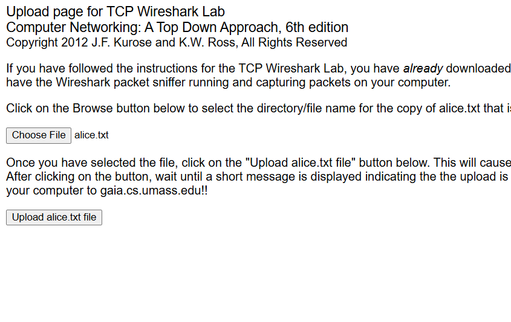

Berikut tampilan halaman browser setelah file berhasil diunggah ke server:

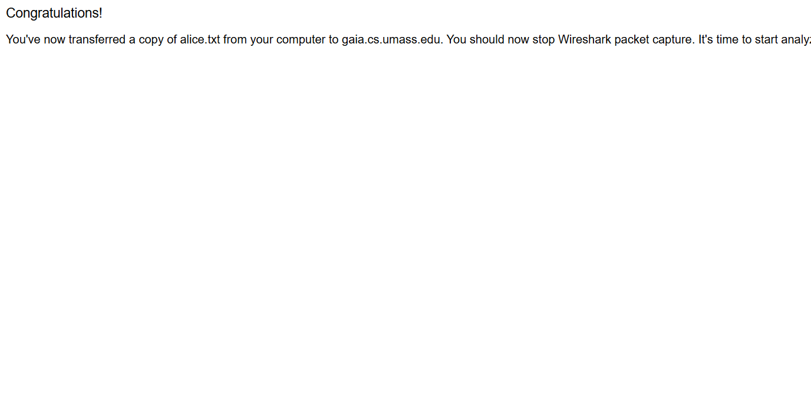
---

## 6.3 TAMPILAN AWAL CAPTURED TRACE

Setelah pengambilan paket selesai, lakukan filter terhadap paket yang ditampilkan pada Wireshark dengan memasukkan `tcp` pada kolom filter. Hasil yang ditampilkan adalah serangkaian pesan TCP dan HTTP antara komputer klien dan `gaia.cs.umass.edu`, termasuk inisiasi *three-way handshake* yang ditandai dengan pesan SYN dan pesan HTTP POST.

Berikut tampilan Wireshark setelah filter `tcp && ip.addr == 128.119.245.12` diterapkan:

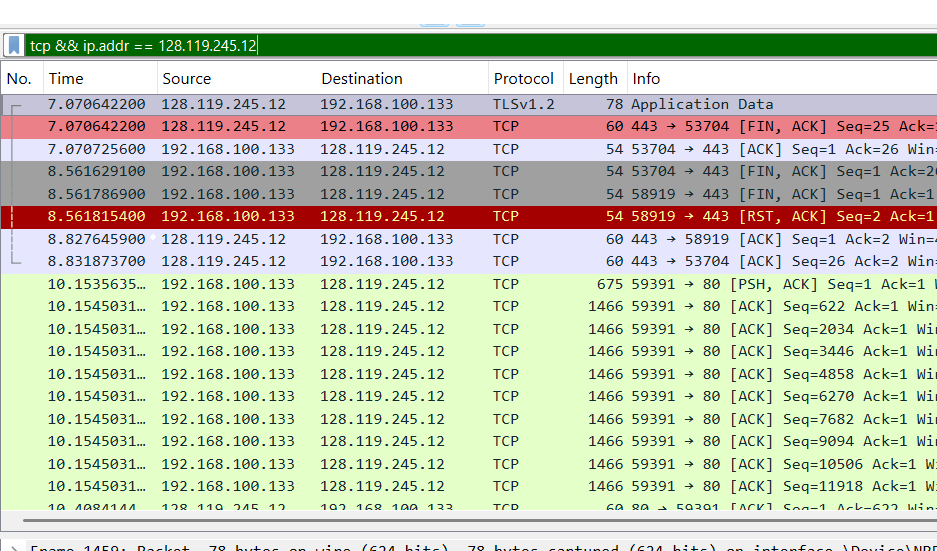

Selanjutnya, ubah tampilan Wireshark agar hanya menampilkan segmen TCP murni tanpa layer HTTP dengan cara memilih **Analyze → Enabled Protocols**, kemudian hapus centang pada **HTTP** dan klik **OK**.

Berikut tampilan menu Enabled Protocols saat HTTP sedang di-uncheck:

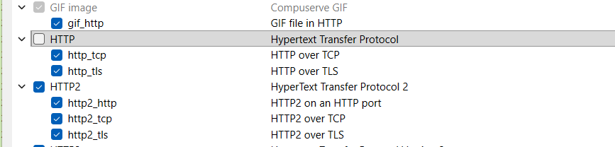

Berikut tampilan Wireshark setelah protokol HTTP dinonaktifkan, sehingga hanya segmen TCP yang ditampilkan:

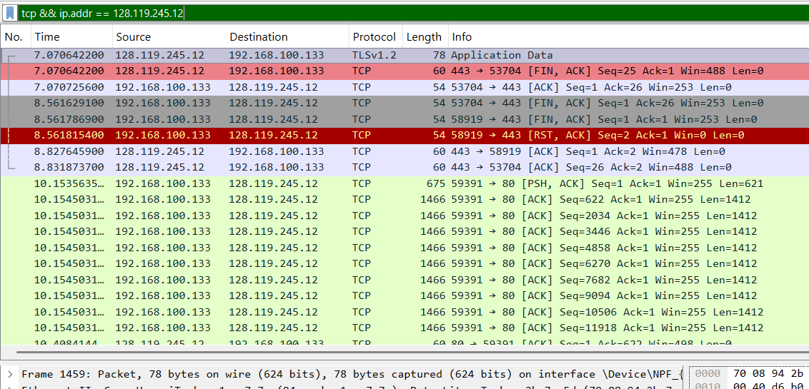
---

### Pertanyaan 1 IP dan Port Klien

Berdasarkan hasil pengamatan pada detail paket TCP yang membawa pesan HTTP POST, diperoleh informasi bahwa komputer klien menggunakan:

- **Alamat IP klien**: `192.168.100.133`
- **Port klien (source port)**: `59391`

Berikut tampilan detail paket TCP yang menunjukkan informasi source port dan destination port klien:

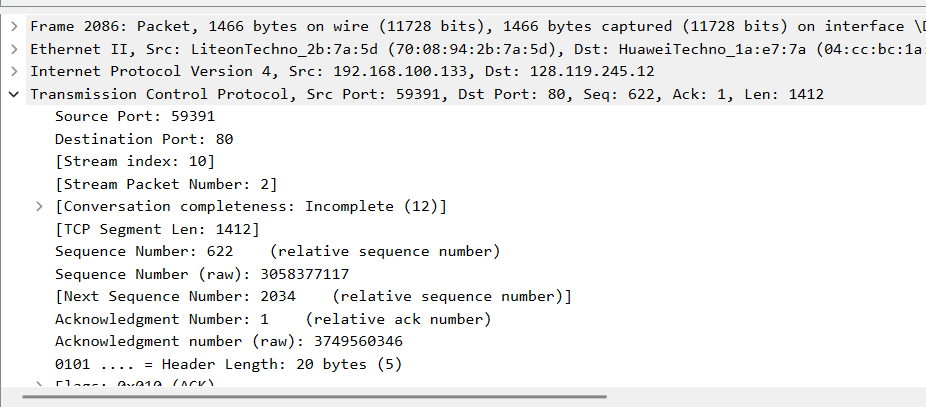

---

### Pertanyaan 2 IP dan Port Server

Berdasarkan hasil pengamatan pada field destination paket TCP yang sama, diperoleh informasi bahwa server `gaia.cs.umass.edu` menggunakan:

- **Alamat IP server**: `128.119.245.12`
- **Port server**: `80` (port standar HTTP)

Informasi ini dapat dilihat pada field **Destination Port: 80** dan **Dst: 128.119.245.12** pada bagian Internet Protocol di Wireshark.

---

## 6.4 DASAR TCP

### Pertanyaan 1 Segmen SYN

Untuk menemukan segmen SYN, gunakan filter `tcp.flags.syn == 1` pada Wireshark. Segmen SYN merupakan paket pertama yang dikirimkan klien untuk memulai proses *three-way handshake*.

Berikut tampilan paket SYN yang tertangkap beserta detail flag-nya:

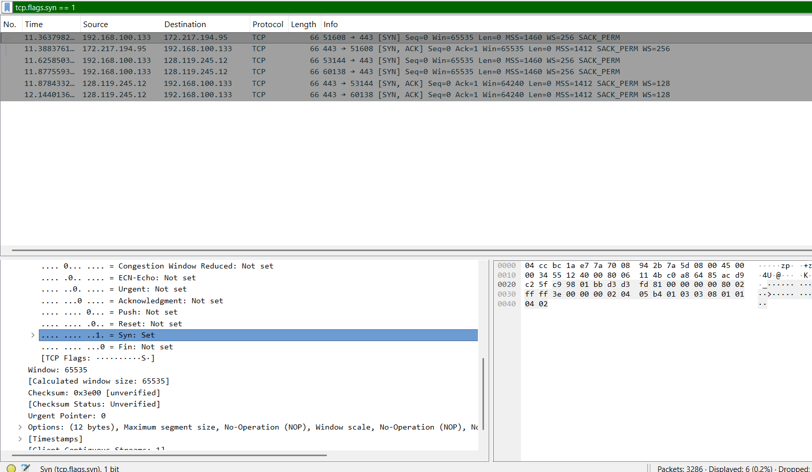

Berdasarkan hasil pengamatan, diketahui bahwa:

- **Nomor urut (Sequence Number)** segmen SYN adalah **0** (relative sequence number)
- Segmen ini diidentifikasi sebagai segmen SYN karena memiliki **flag SYN = 1** (Syn: Set), sementara flag lainnya seperti ACK, PSH, dan FIN bernilai 0

---

### Pertanyaan 2 Segmen SYNACK

Untuk menemukan segmen SYNACK, gunakan filter `tcp.flags.syn == 1 && tcp.flags.ack == 1`. Segmen ini dikirimkan oleh server `gaia.cs.umass.edu` sebagai balasan atas segmen SYN dari klien.

Berikut tampilan paket SYNACK yang tertangkap beserta detail flag-nya:

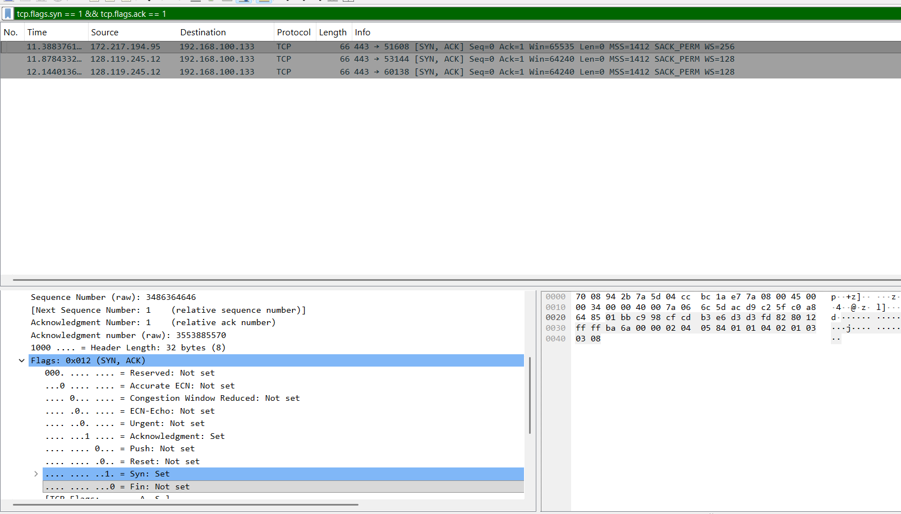

Berdasarkan hasil pengamatan, diketahui bahwa:

- **Nomor urut segmen SYNACK** adalah **0** (relative sequence number)
- **Nilai field Acknowledgement** adalah **1**, yang diperoleh dari nomor urut SYN klien (0) ditambah 1
- Segmen ini diidentifikasi sebagai SYNACK karena memiliki **flag SYN = 1 dan ACK = 1** secara bersamaan (Flags: 0x012)

---

### Pertanyaan 3 Segmen HTTP POST

Untuk menemukan segmen TCP yang berisi perintah HTTP POST, gunakan filter `tcp.port == 1161`, kemudian telusuri isi field data pada setiap paket hingga ditemukan segmen yang mengandung kata "POST".

Berikut tampilan paket yang mengandung perintah HTTP POST:

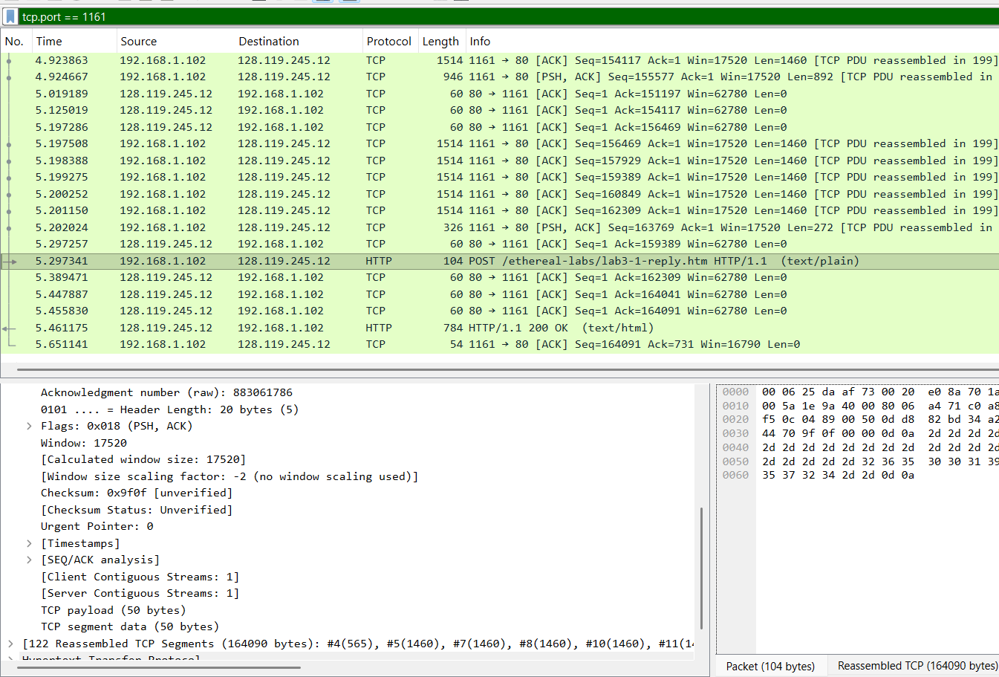

Berdasarkan hasil pengamatan, paket HTTP POST ditemukan pada waktu **5.297341 detik** dengan informasi `POST /ethereal-labs/lab3-1-reply.htm HTTP/1.1`. Paket ini merupakan awal dari proses pengiriman data file alice.txt ke server.

---

### Pertanyaan 4 Nomor Urut, Waktu, dan RTT Enam Segmen Pertama

Dengan menganggap segmen yang berisi HTTP POST sebagai segmen pertama, berikut adalah informasi enam segmen pertama beserta waktu pengiriman dan penerimaan ACK-nya berdasarkan hasil pengamatan pada trace:

Berikut tampilan daftar enam segmen TCP pertama beserta informasi reassembled payload-nya:

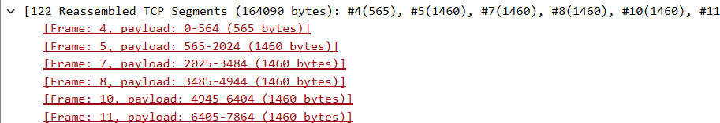

Berdasarkan trace, enam segmen pertama yang teridentifikasi adalah:

- **Frame 4** (Segmen 1): payload 0–564 (565 bytes), dikirim pada t = 0.026477 s
- **Frame 5** (Segmen 2): payload 565–2024 (1460 bytes), dikirim pada t = 0.041737 s
- **Frame 7** (Segmen 3): payload 2025–3484 (1460 bytes), dikirim pada t = 0.054026 s
- **Frame 8** (Segmen 4): payload 3485–4944 (1460 bytes), dikirim pada t = 0.054690 s
- **Frame 10** (Segmen 5): payload 4945–6404 (1460 bytes), dikirim pada t = 0.077405 s
- **Frame 11** (Segmen 6): payload 6405–7864 (1460 bytes), dikirim pada t = 0.078157 s

Nilai RTT diperoleh dari selisih waktu antara segmen dikirim dan ACK diterima. Berdasarkan grafik RTT yang dihasilkan melalui **Statistics → TCP Stream Graph → Round Trip Time Graph**, nilai RTT pada awal koneksi berkisar antara **10 ms hingga 270 ms**, dengan pola yang berfluktuasi secara periodik sepanjang durasi transfer.

Berikut tampilan grafik Round Trip Time (RTT) untuk koneksi TCP ini:

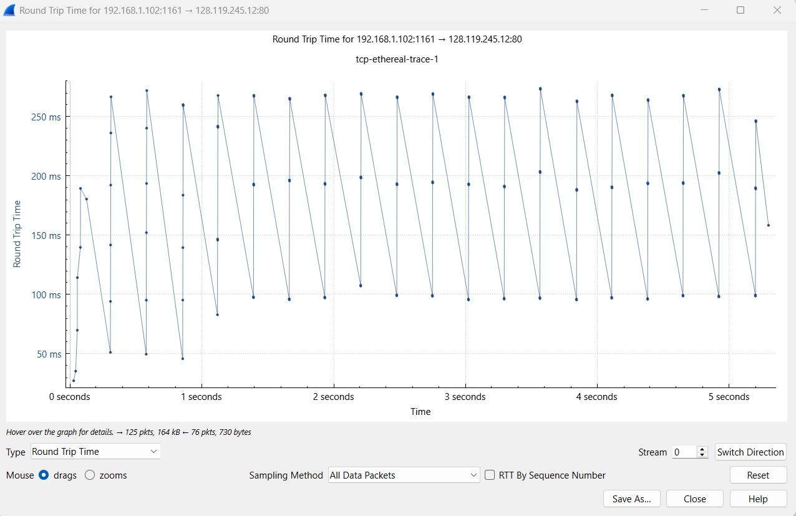

Nilai **EstimatedRTT** dihitung menggunakan rumus *Exponential Weighted Moving Average* (EWMA):

```
EstimatedRTT = (1 - α) × EstimatedRTT + α × SampleRTT
```

dengan nilai α = 0.125 sesuai standar TCP. Terlihat dari grafik bahwa RTT cukup konsisten berada di kisaran 100–270 ms, yang mengindikasikan koneksi lintas jaringan jarak jauh dengan latensi yang relatif stabil.

---

### Pertanyaan 5 Panjang Enam Segmen TCP Pertama

Berdasarkan hasil pengamatan pada detail paket di Wireshark, panjang masing-masing dari enam segmen TCP pertama adalah sebagai berikut:

- Segmen 1 (Frame 4): **565 bytes**
- Segmen 2 (Frame 5): **1460 bytes**
- Segmen 3 (Frame 7): **1460 bytes**
- Segmen 4 (Frame 8): **1460 bytes**
- Segmen 5 (Frame 10): **1460 bytes**
- Segmen 6 (Frame 11): **1460 bytes**

Berikut tampilan detail salah satu segmen TCP yang menunjukkan nilai TCP Segment Len:

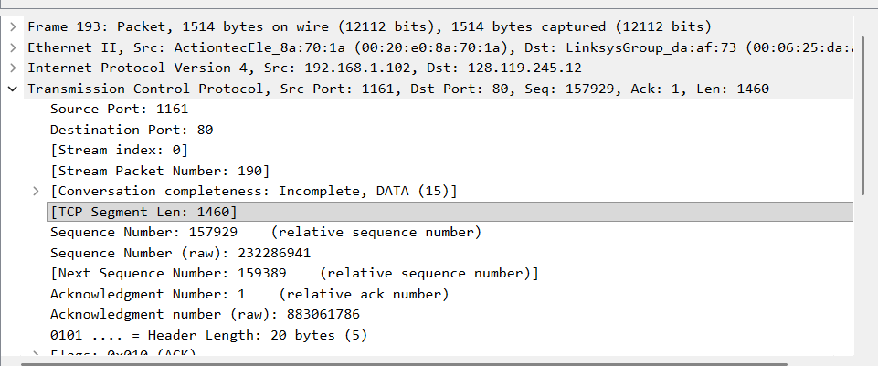

Segmen pertama memiliki ukuran yang lebih kecil karena membawa header HTTP POST beserta sebagian awal data. Segmen-segmen berikutnya memiliki panjang **1460 bytes** yang merupakan nilai **Maximum Segment Size (MSS)** yang disepakati selama proses *three-way handshake*.

---

### Pertanyaan 6 Flow Control (Window Size)

Berikut tampilan three-way handshake yang memperlihatkan nilai Window Size pada setiap segmen awal koneksi:

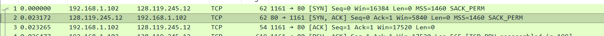

Berdasarkan hasil pengamatan pada segmen SYNACK yang dikirim oleh server, nilai **Window Size** minimum yang ditawarkan oleh penerima (server) adalah **5840 bytes** (terlihat pada paket SYN-ACK: `Win=5840`). Selama proses transfer berlangsung, nilai window size terus berkembang seiring dengan mekanisme *flow control* TCP, yang terlihat dari peningkatan nilai `Win` pada paket-paket ACK berikutnya hingga mencapai **17520 bytes** dan lebih.

Berdasarkan pengamatan pada trace, tidak ditemukan adanya kondisi di mana window size mencapai nol, sehingga dapat disimpulkan bahwa **kurangnya ruang buffer penerima tidak pernah menghambat pengiriman** selama transfer file berlangsung.

---

### Pertanyaan 7 Retransmisi Segmen

Berikut tampilan daftar segmen TCP beserta detail paket SYNACK:

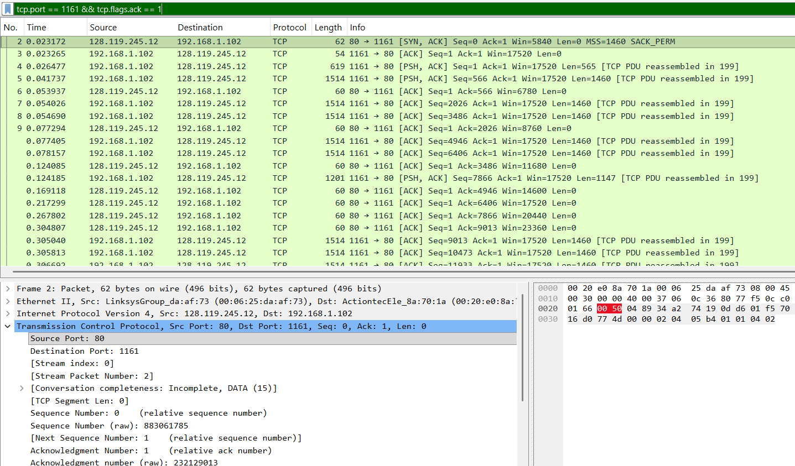

Untuk mendeteksi adanya retransmisi, dilakukan pemeriksaan pada dua indikator utama, yaitu: (1) adanya label **"TCP Retransmission"** atau **"TCP Fast Retransmission"** pada kolom Info di Wireshark, dan (2) adanya **duplicate ACK** yang dikirimkan secara berulang oleh penerima sebagai sinyal bahwa sebuah segmen belum diterima.

Berdasarkan hasil pengamatan pada trace, **tidak ditemukan segmen yang ditransmisikan ulang secara eksplisit** pada rentang segmen yang dianalisis. Hal ini mengindikasikan bahwa transfer file berlangsung dengan kondisi jaringan yang cukup stabil dan tidak terjadi kehilangan paket yang memerlukan retransmisi.

---

### Pertanyaan 8 Perilaku ACK

Berdasarkan hasil pengamatan, penerima (server) pada umumnya menerapkan mekanisme **cumulative ACK**, di mana satu ACK mengakui beberapa segmen sekaligus. Sebagai contoh, terlihat pada trace bahwa setelah beberapa segmen dikirim secara berurutan oleh klien, server mengirimkan ACK yang mengakui sejumlah data sekaligus dalam satu paket.

Namun, pada beberapa kondisi tertentu, terutama di awal koneksi ketika jumlah data yang dikirim masih sedikit, penerima terlihat mengirimkan ACK untuk setiap segmen yang diterima (*per-segment ACK*). Hal ini merupakan perilaku normal TCP yang sesuai dengan implementasi *delayed ACK* standar.

---

### Pertanyaan 9 Throughput TCP

Berikut tampilan grafik Throughput TCP yang dihasilkan melalui **Statistics → TCP Stream Graph → Throughput**:

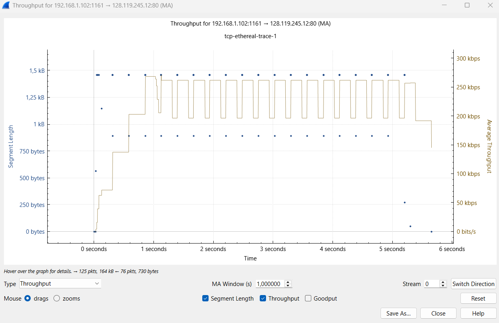

Berdasarkan informasi yang tertera pada grafik, total data yang dikirim dari klien ke server adalah **164 kB** dalam rentang waktu sekitar **5.3 detik** (dari detik ke-0 hingga sekitar detik ke-5.3). Nilai throughput rata-rata dihitung sebagai berikut:

```
Throughput = Total Data / Waktu Transfer
           = 164.090 bytes / 5,3 detik
           ≈ 30.960 bytes/detik
           ≈ 247 kbps
```

Hal ini sesuai dengan tampilan pada grafik yang menunjukkan rata-rata throughput berada di kisaran **200–260 kbps** sepanjang durasi transfer, dengan sedikit fluktuasi yang disebabkan oleh mekanisme *congestion control* TCP.

---

## 6.5 CONGESTION CONTROL PADA TCP

Untuk menganalisis perilaku *congestion control* TCP, digunakan fitur **Statistics → TCP Stream Graph → Time-Sequence-Graph (Stevens)** yang memplot nomor urut segmen terhadap waktu pengirimannya.

Berikut tampilan grafik Time-Sequence (Stevens) yang menggambarkan perilaku congestion control TCP:

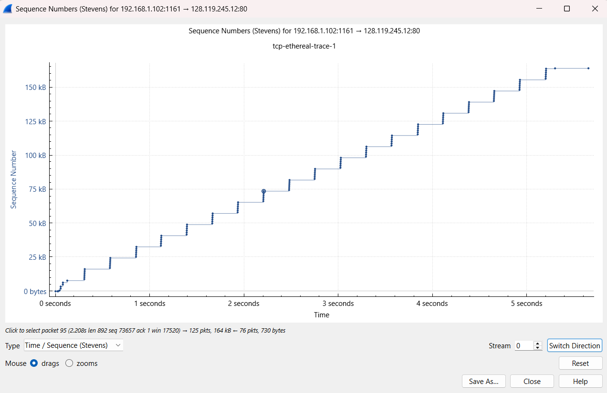

---

### Pertanyaan 1 Identifikasi Slow Start dan Congestion Avoidance

Berdasarkan hasil pengamatan pada grafik Time-Sequence (Stevens), dapat diidentifikasi dua fase utama dari algoritma *congestion control* TCP:

**Fase Slow Start** terjadi pada awal koneksi, yaitu dari detik ke-0 hingga sekitar detik ke-0.5. Pada fase ini, terlihat bahwa nomor urut meningkat secara **eksponensial** dalam waktu singkat hal ini ditandai dengan kenaikan yang curam pada awal grafik, di mana setiap ACK yang diterima menyebabkan ukuran *congestion window* (cwnd) bertambah sebesar satu MSS, sehingga jumlah data yang dikirimkan berlipat ganda setiap RTT.

**Fase Congestion Avoidance** dimulai setelah cwnd mencapai nilai *slow start threshold* (ssthresh), yaitu sekitar detik ke-0.5 ke atas. Pada fase ini, peningkatan nomor urut terlihat lebih **linear dan bertahap**, mencerminkan penambahan cwnd sebesar satu MSS per RTT yang merupakan karakteristik dari algoritma *congestion avoidance*.

Jika dibandingkan dengan perilaku ideal TCP yang dipelajari di teori, terdapat beberapa perbedaan yang terlihat pada data nyata. Pertama, pada grafik terdapat beberapa **"plateau"** atau perataan sementara yang menunjukkan adanya penundaan akibat mekanisme *flow control* dari penerima. Kedua, terdapat beberapa titik di mana jumlah data yang dikirim bertumpuk (*back-to-back*), yang terlihat sebagai kelompok titik yang berdekatan secara vertikal pada grafik. Hal ini terjadi karena TCP mengirimkan beberapa segmen dalam satu *burst* selama window masih tersedia.

---

### Pertanyaan 2 Analisis Grafik dari Trace Sendiri

Hasil pengamatan grafik Time-Sequence Stevens di atas diperoleh dari trace file `tcp-ethereal-trace-1` yang digunakan sebagai referensi dalam praktikum ini. Pola yang terlihat pada grafik menunjukkan bahwa secara keseluruhan transfer file berjalan dengan lancar tanpa adanya penurunan cwnd yang drastis akibat *timeout* maupun *triple duplicate ACK*, yang mengindikasikan tidak adanya congestion signifikan selama proses transfer berlangsung.

Grafik throughput yang telah ditampilkan sebelumnya juga mendukung kesimpulan ini, di mana rata-rata throughput berada pada kisaran 200–260 kbps secara konsisten dari awal hingga akhir transfer, tanpa penurunan mendadak yang berarti.