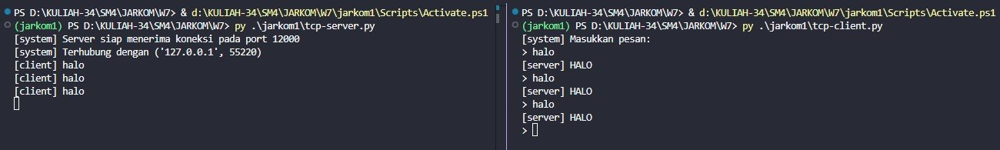
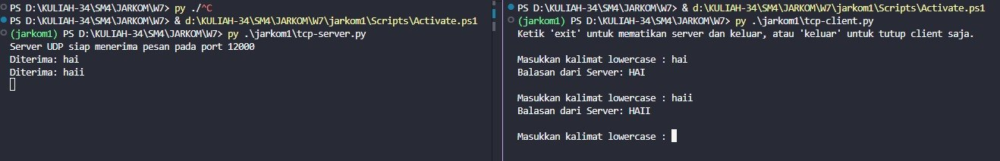

Nama: Adisty Fatika Ardani
NIM: 103072400091

---

# Modul 7 Socket Programming: Membuat Aplikasi Jaringan

## Tujuan Praktikum
1. Mahasiswa dapat membuat aplikasi jaringan sederhana menggunakan socket programming dengan Python
2. Mahasiswa memahami perbedaan implementasi socket menggunakan protokol TCP dan UDP

---

## PROGRAM SOCKET DENGAN TCP

TCP adalah protokol yang *connection-oriented*, artinya sebelum data dapat dikirim harus terbentuk koneksi terlebih dahulu antara client dan server melalui proses *handshaking*. TCP menjamin bahwa data yang dikirim akan sampai ke tujuan secara utuh dan berurutan.

### TCP Server

Sebelum menjalankan server, perlu dipahami alur kerja TCP Server secara umum. Server pertama-tama membuat socket, kemudian mengikat (*bind*) socket tersebut ke port tertentu agar bisa menerima koneksi masuk. Setelah itu server masuk ke mode *listening* untuk menunggu client. Ketika ada client yang terhubung, server menerima koneksi melalui `accept()` yang menghasilkan socket baru khusus untuk komunikasi dengan client tersebut inilah yang membedakan TCP dari UDP. Server kemudian menerima pesan, memprosesnya, dan mengirimkan balasan.

Beberapa hal penting yang perlu dipahami dari kode server ini:
- `AF_INET` berarti socket menggunakan IPv4 sebagai protokol jaringannya
- `SOCK_STREAM` berarti socket menggunakan TCP yang berorientasi koneksi
- `bind(('', serverPort))` mengikat socket ke semua interface jaringan yang tersedia di komputer pada port 12000 tanda `''` berarti menerima koneksi dari interface manapun
- `listen(1)` memberi tahu OS bahwa server siap menerima koneksi, angka `1` adalah jumlah maksimal koneksi yang bisa mengantri
- `accept()` memblokir program sampai ada client yang terhubung, lalu mengembalikan socket baru (`connectionSocket`) dan alamat client (`addr`)
- `recv(2048)` menerima data dari client maksimal 2048 byte program berhenti di sini sampai ada data masuk
- `connectionSocket.close()` menutup hanya koneksi dengan client tersebut, bukan `serverSocket` yang masih terus menunggu client baru

Berikut kode program TCP Server beserta penjelasannya:

```python
from socket import *

serverPort = 12000

# Membuat socket TCP (SOCK_STREAM = TCP)
serverSocket = socket(AF_INET, SOCK_STREAM)

# Mengikat socket ke semua interface jaringan pada port 12000
serverSocket.bind(('', serverPort))

# Mulai mendengarkan koneksi masuk, maksimal 1 antrian
serverSocket.listen(1)
print("[system] Server siap menerima koneksi pada port " + str(serverPort))

running = True
while running:
    # Menerima koneksi baru dari client - program berhenti di sini sampai ada client
    connectionSocket, addr = serverSocket.accept()
    print("[system] Terhubung dengan " + str(addr))

    while True:
        # Menerima pesan dari client, maksimal 2048 byte
        message = connectionSocket.recv(2048).decode()

        # Jika pesan kosong, berarti client sudah disconnect
        if not message:
            print("[system] Client " + str(addr) + " disconnect.")
            break

        # Jika client mengirim "exit", tutup koneksi
        if message.lower() == "exit":
            print("[system] Koneksi dengan " + str(addr) + " ditutup.")
            break

        # Mengubah pesan menjadi huruf kapital lalu kirim balik ke client
        modifiedMessage = message.upper()
        print("[client] " + message)
        connectionSocket.send(modifiedMessage.encode())

    # Tutup socket koneksi dengan client ini (bukan serverSocket)
    connectionSocket.close()
```

### TCP Client

Berbeda dengan server, client tidak perlu `bind()` karena OS akan secara otomatis mengalokasikan port sementara (*ephemeral port*) untuk client. Hal terpenting yang membedakan TCP client dari UDP adalah penggunaan `connect()` perintah ini memulai proses *three-way handshaking* (SYN, SYN-ACK, ACK) dengan server sebelum data apapun bisa dikirim. Jika `connect()` berhasil, berarti koneksi sudah terbentuk dan komunikasi bisa dimulai.

Beberapa hal penting dari kode client ini:
- `connect((serverName, serverPort))` membangun koneksi ke server program akan error jika server belum berjalan
- `send(message.encode())` mengirim pesan dalam bentuk bytes, karena socket hanya bisa mengirim data dalam format bytes, bukan string langsung
- `recv(2048)` menunggu balasan dari server program berhenti di sini sampai server mengirim respons
- `.decode()` mengubah bytes yang diterima kembali menjadi string agar bisa ditampilkan
- `clientSocket.close()` penting dilakukan setelah selesai untuk melepaskan resource jaringan

Berikut kode program TCP Client beserta penjelasannya:

```python
from socket import *

serverName = 'localhost'
serverPort = 12000

# Membuat socket TCP (SOCK_STREAM = TCP)
clientSocket = socket(AF_INET, SOCK_STREAM)

# Membangun koneksi ke server - ini yang membedakan TCP dari UDP
clientSocket.connect((serverName, serverPort))

print("[system] Masukkan pesan:")

running = True
while running:
    message = input("> ")

    # Mengirim pesan ke server dalam bentuk bytes
    clientSocket.send(message.encode())

    # Jika pesan "exit", keluar dari program
    if message == "exit":
        print("[system] Keluar dari program.")
        running = False
        break

    # Menerima balasan dari server dan menampilkannya
    modifiedMessage = clientSocket.recv(2048).decode()
    print("[server] " + modifiedMessage)

# Menutup socket setelah selesai
clientSocket.close()
print("[system] Socket ditutup.")
```

### Output TCP

Berikut hasil output program TCP Server dan TCP Client yang berjalan bersamaan:



Pada percobaan ini, client mengirimkan pesan `halo` dan server membalas dengan `HALO` (huruf kapital). Proses ini menunjukkan bahwa koneksi TCP berhasil terbentuk dan komunikasi dua arah berjalan dengan baik.

---

## PROGRAM SOCKET DENGAN UDP

UDP adalah protokol yang *connectionless*, artinya tidak perlu membangun koneksi terlebih dahulu sebelum mengirim data. Setiap paket dikirim secara independen sehingga lebih cepat namun tidak ada jaminan data sampai ke tujuan.

### UDP Server

UDP Server jauh lebih sederhana dari TCP Server karena tidak ada proses membangun koneksi. Server hanya perlu membuat socket, melakukan `bind()` ke port tertentu, lalu langsung siap menerima pesan dari siapapun. Tidak ada `listen()` maupun `accept()` karena UDP tidak mengenal konsep koneksi setiap paket datang secara independen.

Beberapa hal penting dari kode UDP Server ini:
- `SOCK_DGRAM` berarti socket menggunakan UDP yang bersifat *connectionless*
- `recvfrom(2048)` berbeda dari `recv()` di TCP selain data, fungsi ini juga mengembalikan alamat pengirim (`clientAddress`) karena UDP tidak tahu siapa yang akan mengirim pesan
- `clientAddress` diperlukan untuk mengirim balasan ke alamat yang tepat menggunakan `sendto()`
- Blok `try-except-finally` digunakan untuk memastikan socket selalu ditutup meskipun terjadi error di tengah program
- Server bisa menerima pesan dari banyak client berbeda tanpa perlu membuka koneksi baru untuk masing-masing client

Berikut kode program UDP Server beserta penjelasannya:

```python
from socket import *
import sys

serverPort = 12000

# Membuat socket UDP (SOCK_DGRAM = UDP)
serverSocket = socket(AF_INET, SOCK_DGRAM)

# Mengikat socket ke semua interface jaringan pada port 12000
serverSocket.bind(('', serverPort))

print(f"Server UDP siap menerima pesan pada port {serverPort}")

try:
    while True:
        # Menerima pesan dari client beserta alamat pengirim
        # UDP tidak perlu accept() karena tidak ada koneksi permanen
        message, clientAddress = serverSocket.recvfrom(2048)
        original_message = message.decode().strip()

        # Jika client mengirim "exit", matikan server
        if original_message.lower() == 'exit':
            print("Mematikan server...")
            break

        # Mengubah pesan menjadi huruf kapital
        modifiedMessage = original_message.upper()
        print(f"Diterima: {original_message}")

        # Mengirim balasan ke alamat client yang tadi mengirim pesan
        serverSocket.sendto(modifiedMessage.encode(), clientAddress)

except Exception as e:
    print(e)
finally:
    # Selalu tutup socket meskipun terjadi error
    serverSocket.close()
```

### UDP Client

UDP Client bahkan lebih sederhana dari TCP Client karena tidak perlu `connect()` sama sekali. Client langsung bisa mengirim data ke server menggunakan `sendto()` tanpa perlu menunggu koneksi terbentuk. Namun justru karena itulah UDP lebih berisiko tidak ada jaminan pesan sampai ke server, dan tidak ada notifikasi jika server tidak aktif.

Beberapa hal penting dari kode UDP Client ini:
- `serverName = '192.168.1.4'` berbeda dari TCP yang menggunakan `localhost`, di sini digunakan IP address jaringan lokal karena pengujian dilakukan antar perangkat berbeda
- `settimeout(5)` sangat penting di UDP karena tidak ada mekanisme bawaan untuk mendeteksi apakah server aktif atau tidak tanpa timeout, program bisa menunggu selamanya jika server tidak merespons
- `sendto(message.encode(), (serverName, serverPort))` mengirim data langsung ke alamat server tanpa perlu koneksi terlebih dahulu
- `recvfrom(2048)` mengembalikan data balasan beserta alamat server alamat ini bisa berbeda jika ada beberapa server
- Blok `try-except timeout` menangani kondisi ketika server tidak merespons dalam batas waktu yang ditentukan
- `finally` memastikan `clientSocket.close()` selalu dijalankan meskipun terjadi error

Berikut kode program UDP Client beserta penjelasannya:

```python
from socket import *
import sys

# Konfigurasi alamat dan port server
serverName = '192.168.1.4'
serverPort = 12000

# Membuat socket UDP di luar loop agar tidak dibuat berulang-ulang
clientSocket = socket(AF_INET, SOCK_DGRAM)

# Batas waktu tunggu 5 detik jika server tidak merespons
clientSocket.settimeout(5)

print("Ketik 'exit' untuk mematikan server dan keluar, atau 'keluar' untuk tutup client saja.\n")

try:
    while True:
        message = input('Masukkan kalimat lowercase : ')

        # Validasi jika input kosong, ulangi input
        if not message:
            continue

        # Mengirim pesan ke server - UDP langsung kirim tanpa koneksi terlebih dahulu
        clientSocket.sendto(message.encode(), (serverName, serverPort))

        # Cek apakah pengguna ingin keluar
        if message.lower() == 'exit':
            print("Perintah exit dikirim. Mematikan server dan menutup klien...")
            break
        elif message.lower() == 'keluar':
            print("Menutup klien...")
            break

        try:
            # Menerima balasan dari server beserta alamat server
            modifiedMessage, serverAddress = clientSocket.recvfrom(2048)
            print(f"Balasan dari Server: {modifiedMessage.decode()}\n")
        except timeout:
            # Jika server tidak merespons dalam 5 detik
            print("Kesalahan : Server tidak merespons (Timeout).\n")

except Exception as e:
    print(f"Terjadi kesalahan : {e}")
finally:
    # Menutup socket secara permanen saat loop berhenti
    clientSocket.close()
    print("Koneksi ditutup.")
```

### Output UDP

Berikut hasil output program UDP Server dan UDP Client yang berjalan bersamaan:



Pada percobaan ini, client mengirimkan pesan `hai` dan `haii`, kemudian server membalas dengan `HAI` dan `HAII`. Berbeda dengan TCP, pada UDP tidak terdapat proses *handshaking* sehingga server langsung menerima pesan tanpa perlu membangun koneksi terlebih dahulu.

---

## PERBEDAAN TCP DAN UDP

Berdasarkan hasil percobaan, terdapat beberapa perbedaan mendasar antara implementasi socket TCP dan UDP:

- **Jenis koneksi** TCP menggunakan `SOCK_STREAM` dan memerlukan `connect()` di client serta `accept()` di server untuk membangun koneksi. UDP menggunakan `SOCK_DGRAM` dan langsung mengirim data menggunakan `sendto()` tanpa perlu membangun koneksi.
- **Keandalan** TCP menjamin data sampai ke tujuan secara utuh dan berurutan. UDP tidak menjamin hal tersebut namun lebih ringan dan cepat.
- **Penggunaan** TCP cocok untuk aplikasi yang membutuhkan keandalan seperti transfer file dan web browsing. UDP cocok untuk aplikasi yang membutuhkan kecepatan seperti video streaming dan game online.