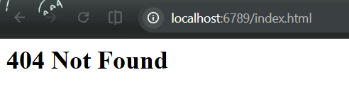
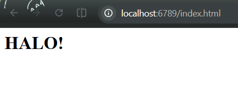
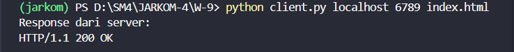
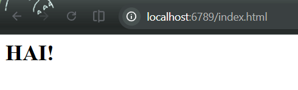

Nama: Adisty Fatika Ardani
NIM: 103072400091

---

# Modul 9 Web Server

## Tujuan Praktikum
1. Mahasiswa bisa membuat program web server sederhana berbasis TCP socket programming

---

## PENGANTAR

Pada modul ini dibuat web server sederhana berbasis TCP socket yang mampu menerima HTTP request dari browser maupun client, membaca file yang diminta dari sistem file server, lalu mengirimkan respons HTTP beserta isi filenya. Jika file tidak ditemukan, server mengirimkan respons `404 Not Found`.

---

## WEB SERVER SEDERHANA

### Kode Server

```python
from socket import *
import sys

serverSocket = socket(AF_INET, SOCK_STREAM)

serverPort = 6789
serverSocket.bind(('', serverPort))
serverSocket.listen(1)

print('Web Server is running...')

while True:
    print('Ready to serve...')
    connectionSocket, addr = serverSocket.accept()

    try:
        message = connectionSocket.recv(1024).decode()
        filename = message.split()[1]
        f = open(filename[1:])
        outputdata = f.read()

        connectionSocket.send("HTTP/1.1 200 OK\r\n\r\n".encode())

        for i in range(len(outputdata)):
            connectionSocket.send(outputdata[i].encode())

        connectionSocket.close()

    except IOError:
        connectionSocket.send("HTTP/1.1 404 Not Found\r\n\r\n".encode())
        connectionSocket.send("<html><body><h1>404 Not Found</h1></body></html>".encode())
        connectionSocket.close()

serverSocket.close()
sys.exit()
```

Server dibuat menggunakan `SOCK_STREAM` karena web server berbasis TCP yang butuh koneksi yang andal. `bind(('', serverPort))` mengikat server ke semua interface yang tersedia pada port 6789, dan `listen(1)` memberi tahu OS bahwa server siap menerima koneksi dengan antrian maksimal 1.

Di dalam loop, `serverSocket.accept()` memblokir program sampai ada client yang masuk setelah itu `connectionSocket` digunakan khusus untuk komunikasi dengan client tersebut. Request HTTP yang masuk kemudian di-decode dan di-split untuk mengambil nama file yang diminta, misalnya dari `GET /index.html HTTP/1.1` akan diambil `/index.html`. `filename[1:]` digunakan untuk membuang karakter `/` di depannya agar bisa dibuka sebagai file lokal.

Jika file berhasil dibuka, server mengirimkan header `HTTP/1.1 200 OK` diikuti isi file karakter per karakter. Jika file tidak ditemukan (`IOError`), server mengirimkan `404 Not Found` beserta halaman HTML sederhana sebagai respons.




### File HTML (index.html)

```html
<h1>HALO!</h1>
```

File ini diletakkan di direktori yang sama dengan server. Ketika client mengakses `http://localhost:6789/index.html`, server akan membaca file ini dan mengirimkan isinya sebagai respons.

### Output Server



---

## LATIHAN TAMBAHAN 9.6

### HTTP Client

Daripada menggunakan browser, dibuat HTTP client sendiri yang terhubung ke server via TCP, mengirim HTTP GET request, lalu menampilkan respons dari server.

```python
from socket import *
import sys

server_host = sys.argv[1]
server_port = int(sys.argv[2])
filename = sys.argv[3]

clientSocket = socket(AF_INET, SOCK_STREAM)
clientSocket.connect((server_host, server_port))

request = f"GET /{filename} HTTP/1.1\r\nHost: {server_host}\r\n\r\n"
clientSocket.send(request.encode())

response = clientSocket.recv(4096)

print("Response dari server:")
print(response.decode())

clientSocket.close()
```

Client mengambil tiga argumen dari command line host, port, dan nama file sehingga bisa dijalankan fleksibel tanpa perlu mengubah kode. Request HTTP dibangun secara manual dalam format standar: `GET /namafile HTTP/1.1` diikuti header `Host` dan dua CRLF sebagai penanda akhir header. Setelah request dikirim, client menunggu respons dari server lalu menampilkannya.

Cara menjalankan:
```
python client.py localhost 6789 index.html
```

### Output Client






Berdasarkan output di atas, server berhasil mengembalikan respons `HTTP/1.1 200 OK` yang menandakan file berhasil ditemukan dan dikirimkan.

---

## MULTITHREADED WEB SERVER

Server sederhana di atas hanya bisa melayani satu client dalam satu waktu karena setiap request diproses secara blocking di loop utama. Untuk menangani banyak client secara bersamaan, digunakan threading setiap koneksi yang masuk dijalankan di thread terpisah sehingga server bisa terus menerima koneksi baru tanpa harus menunggu request sebelumnya selesai.

```python
from socket import *
import threading

def handle_client(connectionSocket, addr):
    print(f"Terhubung dengan {addr}")

    try:
        message = connectionSocket.recv(1024).decode()
        print("Request:\n", message)

        filename = message.split()[1]

        if filename == '/':
            filename = '/index.html'

        f = open(filename[1:])
        outputdata = f.read()

        connectionSocket.send("HTTP/1.1 200 OK\r\n\r\n".encode())
        connectionSocket.send(outputdata.encode())

    except IOError:
        connectionSocket.send("HTTP/1.1 404 Not Found\r\n\r\n".encode())
        connectionSocket.send("<h1>404 Not Found</h1>".encode())

    except Exception as e:
        print("Error:", e)

    finally:
        connectionSocket.close()
        print(f"Koneksi {addr} ditutup\n")


serverSocket = socket(AF_INET, SOCK_STREAM)
serverPort = 6789
serverSocket.bind(('', serverPort))
serverSocket.listen(5)

print(f"Server berjalan di http://localhost:{serverPort}")

while True:
    print("Menunggu koneksi...")
    connectionSocket, addr = serverSocket.accept()

    client_thread = threading.Thread(
        target=handle_client,
        args=(connectionSocket, addr)
    )
    client_thread.start()
```

Logika penanganan request dipindahkan ke fungsi `handle_client()` agar bisa dijalankan di thread terpisah. Setiap kali ada koneksi masuk, dibuat `Thread` baru dengan `target=handle_client` yang langsung di-`start()` sehingga loop utama segera kembali ke `accept()` untuk menunggu client berikutnya tanpa perlu menunggu request sebelumnya selesai.

`listen(5)` diubah dari 1 menjadi 5 karena server sekarang perlu menampung lebih banyak antrian koneksi yang masuk bersamaan. Penambahan pengecekan `if filename == '/'` memastikan ketika client mengakses root URL tanpa nama file, server otomatis melayani `index.html` sebagai halaman default. Blok `finally` digunakan untuk memastikan `connectionSocket.close()` selalu dijalankan meski terjadi error di tengah proses ini penting agar tidak ada socket yang dibiarkan terbuka.